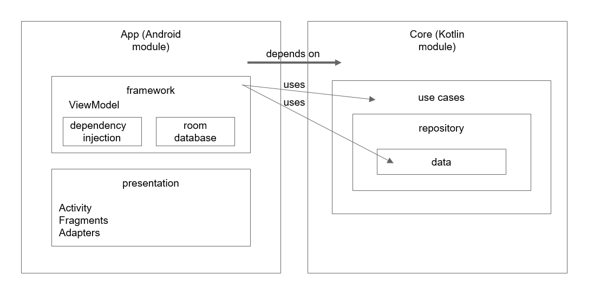

# Clean Architecture

É uma arquitetura que procura atender aos princípios SOLID e foi criado pelo Uncle Bob com o objetivo de ser fácil de fazer manutenção e ser melhor escalável. 

- Seguindo o princípio de Solid Responsability do SOLID, possui uma responsabilidade por componente.
- É estruturado em camadas de dependência
- Camadas de implementação dependem de camadas abstratas
- Não é específica para o desenvolvimento mobile
- É uma arquitetura estrita, então é difícil cometer erros
- Regras de negócio está encapsulada, isolada de outras camadas, então fica mais fácil usar e testar
- Força que as dependências sejam encapsuladas
- Permite desenvolvimento em paralelo - vários desenvolvedores podem trabalhar sem interferir no trabalho do outro
- Altamente escalável
- Fácil de entender e manter
- Testar é mais fácil

https://github.com/bufferapp/android-clean-architecture-boilerplate

## Domain (regras de negócio) - camada amarela

É responsável por conter a instância UseCase usada para recuperar dados da camada Data e passá-las para a camada Presentation. É um módulo Kotlin/Java puro, ou seja, não possui dependências Android.

- **Model**: são entidades que possuem somente os dados que queremos enviar para os ViewModels da camada Presentation, ou seja, o dado mapeado do backend.
- **UseCases**: contém as regras de negócios com base nos dados solicitados do repository. Digamos que ele é blindado, ou seja, mudanças feitas aqui não devem afetar outros módulos do projeto, assim como mudanças em outros módulos não devem refletir no UseCase.
- **Repository**: É a interface de comunicação que solicita dados do Remote ou Cache

## Data

Gerencia os dados que podem ser fornecidos por API (Remote) ou Database (Cache). Quando a Domain pede algum dado, ela não sabe de onde eles são fornecidos, pois isso é responsabilidade do módulo Data.

- API: endpoints para requisitar os dados do backend
- Model: aqui ficam as entidades que vêm do Remote ou da Cache, ou seja, o dado puro, que só é utilizado no módulo Data
- Mapper: mapeia os models para seguir as entidades exigidas pela Domain
- Repository Impl: aqui implementamos a interface repository da domain e é onde vamos decidir de qual lugar vamos pegar os dados: se do Cache ou Remote
- Data Source Interface: interface de comunicação que é implementada na Cache e/ou Remote para pegar os dados, tanto localmente quanto externamente.

## User Interface

Esse módulo usa o Android Framework e é usada para criar todos os componentes de UI. Essa camada recebe dados do módulo Presentation e, quando 

## Presentation

A responsabilidade dessa camada é lidar com a apresentação da User Interface, mas ao mesmo tempo não deve ter conhecimento sobre a User Interface. Esse módulo não tem dependências do Android, é puramente um módulo Kotlin. Cada classe do Presenter criada implementa uma interface Presenter definida na instância de um contrato.

# Clean Architecture como camadas

Essa imagem é a que mostra a arquitetura mais comumente:

As setas com ponta preta indicam dependência.

## Camada entities (DOMAIN)

- Possui objetos do domínio
- Tem a regra de negócio
- POJOs - models
- Não depende de nada 

## Camada UseCases (DOMAIN)

- Abriga ações que podem ser realizadas nas entities
- Depende das entitities
- Lógica de negócio, puro código
- Não tem outras dependências, só nas entities
- O UseCase não sabe como o resultado será utilizado

## Camada Controllers, Presenters e Adapters

- Interfaces
- Pega a data do UseCase e transforma em algo que pode ser entendido pela próxima camada (camada externa)
- Recupera dados de várias fontes
- Apresenta dados em um formato específico
- Depende da camada externa (próxima camada)

## Camada Infrastructure

- Como os dados são interpretados e apresentados
- Camada mais volátil, com mais chances de ser alterada
- Interage com interfaces para recuperar dados
- UI, Frameworks, devices, etc.

***

https://proandroiddev.com/multiple-ways-of-defining-clean-architecture-layers-bbb70afa5d4a

***

# Modularização

Ao invés de trabalhar com um app monolítico, é melhor usar a modularização, mesmo quando o app é "pequeno".

- 1ª de 5 partes sobre modularização: https://jeroenmols.com/blog/2019/03/06/modularizationwhy/
- 1ª de 3 partes sobre modularização (data/ presentation/ domain): https://medium.com/android-dev-br/modularização-android-parte-1-b69b509571c9

## Estrutura de projeto

O Clean Architecture não é um modelo de arquitetura para ser simplesmente copiado. Cada projeto e programador terá uma maneira que considera melhor de aplicar o Clean Architecture.

***

# Glossário

- Contract: permite a comunicação de/ para o Presenter

- UseCase: Contém as regras de negócio que serão aplicados nos dados que vêm de Data

- Mapper: converte os dados de um model para que seja entendido pelo módulo de outra camada (.map)

- Presenter:

  	> A tarefa do Presenter é reembalar o OutputData no formato visível como o ViewModel, que é outro objeto Java antigo simples. O ViewModel contém principalmente Strings e sinalizadores que a View usa para exibir os dados. Enquanto o OutputData pode conter objetos Date, o Presenter carregará o ViewModel com as Strings correspondentes já formatadas corretamente para o usuário. O mesmo vale para objetos Currency ou quaisquer outros dados relacionados a negócios. Os nomes de botão e MenuItem são colocados no ViewModel, assim como os sinalizadores que informam ao modo de exibição se esses botões e itens de menu devem estar em cinza.
    	>
  	> -- Uncle Bob

- Interactor: 

- Controller: Pega o input do usuário, converte para o modelo requerido pelo UseCaseInteractor e passa para ele. O objeto aceito pelo controller é definido pelo controller. Ele NÃO pode depender de views ou tipos definidos pelo framework.

# Links úteis

https://proandroiddev.com/why-you-need-use-cases-interactors-142e8a6fe576

https://proandroiddev.com/the-real-repository-pattern-in-android-efba8662b754

https://proandroiddev.com/multiple-ways-of-defining-clean-architecture-layers-bbb70afa5d4a
<!--stackedit_data:
eyJoaXN0b3J5IjpbMTQ3MzQ1MjMxOSwxODUyNTQyMTExLDE1Nj
U4MTI0OTNdfQ==
-->
