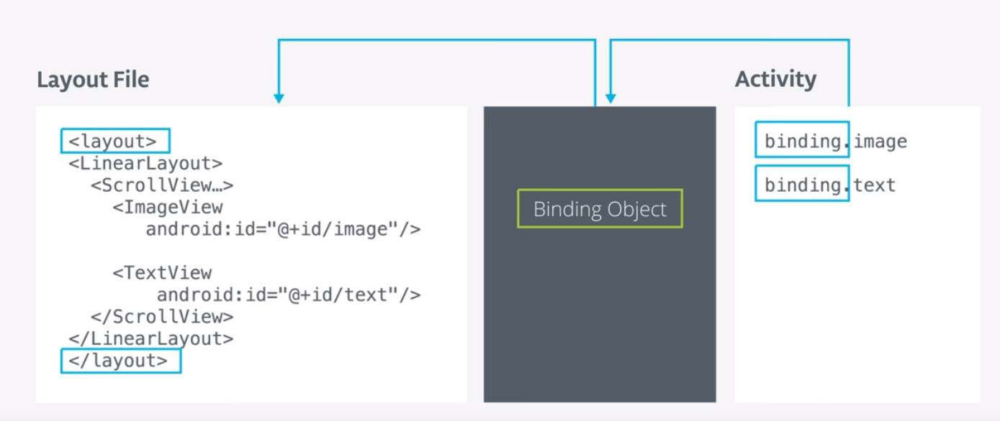
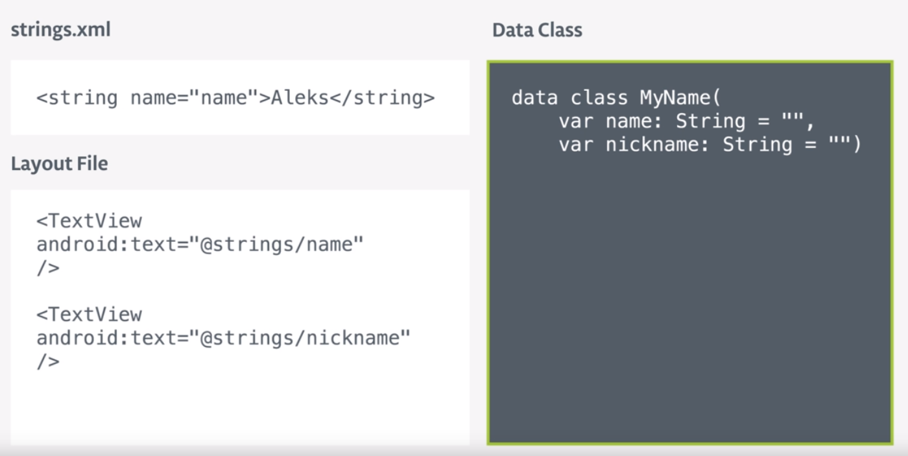
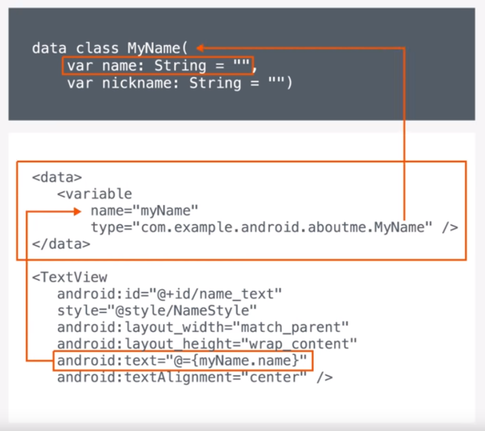

# Data Binding

É uma forma mais simples de fazer o `findViewById`. O maior benefício é, com grandes itens na tela, ele não dar lag para o usuário, já que o `findViewById` vai ser chamado toda vez que rodar.

O Data Binding conecta o layout a uma activity/ fragment  e gera o objeto Binding no momento da compilação, apenas uma vez, para todas as views no layout que têm um ID, o que diminui o consumo de recursos. Ele faz parte do Android Jetpack/ AndroidX.

## Conexão Simples



### Adicionar dependência

O primeiro passo é adicionar o suporte ao Data Binding no projeto. Adicione no `build.gradle` do app, dentro do bloco `android{}`:

```kotlin
dataBinding {
        enabled = true
    }
```

### Adicione XML ao < layout >

É preciso fazer um ajuste no arquivo de layout da tela e inserir todo o código dentro da tag layout. Mova as declarações do ViewGroup principal para a tag Layout.

```xml
<layout xmlns:android="http://schemas.android.com/apk/res/android"
    xmlns:app="http://schemas.android.com/apk/res-auto"
    xmlns:tools="http://schemas.android.com/tools">
  <!-- ADICIONE O VIEWGROUP E O LAYOUT DENTRO DA TAG -->
</layout>
```

### Conecte na Activity/ Fragment

```kotlin
	//cria uma variável do tipo NomeDaActivityBinding
	private lateinit var binding: ActivityMainBinding

  override fun onCreate(savedInstanceState: Bundle?) {
        super.onCreate(savedInstanceState)
    //o setContentView agora é instanciado para um objeto que suporta DataBinding
        binding = DataBindingUtil.setContentView(this, R.layout.activity_main)

		//binding permite chamar os ids diretamente, e, o que antes tinha _ é transformado em Camelcase
        binding.buttonMainDone.setOnClickListener { addNickname(it) }
  }
```

```kotlin
private fun addNickname(view: View) {
  			//dá para melhorar a leitura de vários itens usando o binding.apply{}
        binding.apply {
            textMainNickname.text = editMainNickname.text
          	invalidateAll() //limpa os dados para que sejam preenchidos novamente
            editMainNickname.visibility = View.GONE
            buttonMainDone.visibility = View.GONE
            textMainNickname.visibility = View.VISIBLE
        }

        val imm = getSystemService(Context.INPUT_METHOD_SERVICE) as InputMethodManager
        imm.hideSoftInputFromWindow(view.windowToken, 0)
    }
```

## Conexão com dados (data class)



Primeiro, é preciso criar uma data class, se já não tem ela criada. O código dela é basicamente o mesmo que o sugerido na imagem acima, para o exemplo. No XML precisa adicionar, logo abaixo da tag de abertura de `<layout>`, o bloco abaixo, conectando a Activity com o layout:

```xml
<data>
        <variable
            name="Name"
            type="com.example.aboutme.Name" />
    </data>
```

Depois, os campos precisam referenciar as propriedades da classe modelo. É na propriedade `android:text` que isso acontece neste exemplo.



Ok. Conectado, mas como eu vou setar o texto propriamente dito? Como normalmente acontece, cria uma instância do data class, e atribui a ele o valor do EditText.

```kotlin
private val myName : Name = Name("Nina Lofrese")

//atribui o nome setado a View.
binding.name = myName

//atribui o valor do EditText à instância
myName?.nickname = editMainNickname.text.toString()
```

## Conexão com ViewModel

É possível conectar diretamente com o ViewModel também.

```xml
    <data>
        <variable
            name="sleepTrackerViewModel"
            type="com.example.android.trackmysleepquality.sleeptracker.SleepTrackerViewModel" />
    </data>
```

```kotlin
//SleepTrackerFragment
val binding: FragmentSleepTrackerBinding = DataBindingUtil.inflate(
            inflater, R.layout.fragment_sleep_tracker, container, false
        )
//atribui o variable do XML ao viewModel declarado no Fragment
binding.sleepTrackerViewModel = viewModel
```

Exemplo de view se conectando diretamente com o ViewModel:

```xml
<!-- campos enabled e onClick são conectados usando o @{}, uma expressão lambda -->
<Button
        android:id="@+id/start_button"
        style="@style/SleepButtons"
        android:layout_width="wrap_content"
        android:layout_height="wrap_content"
        android:layout_marginStart="@dimen/margin"
        android:enabled="@{sleepTrackerViewModel.startButtonVisible}"
        android:onClick="@{() -> sleepTrackerViewModel.onStartTracking()}"
        android:text="@string/start"
        app:layout_constraintBaseline_toBaselineOf="@id/stop_button"
        app:layout_constraintEnd_toStartOf="@+id/stop_button"
        app:layout_constraintHorizontal_chainStyle="spread"
        app:layout_constraintStart_toStartOf="parent" />
```

## Binding Adapters

Geralmente, é um método estático que fará conversão e injeção de dados para um atributo específico do layout.

Os Binding Adapters são responsáveis por realizar as chamadas de framework adequadas para definir valores. Um exemplo é a configuração de um valor de propriedade como a chamada para o método `setText()`. Outro exemplo é a definição de um listener de eventos como a chamada para o método `setOnClickListener()`.

A Data Binding Library permite especificar o método chamado para definir um valor, fornecer sua própria lógica de vinculação e especificar o tipo de objeto retornado usando adaptadores. Sempre que um valor vinculado muda, a classe de vinculação gerada precisa chamar um método setter na visualização com a expressão de vinculação. Você pode permitir que a Data Binding Library determine automaticamente o método, declare-o explicitamente ou forneça uma lógica personalizada para selecionar um método. Ele cria novos atributos para o XML para suprir tipos incomuns. Por exemplo, uma ImageView recebe no atributo `src`somente um Bitmap ou um Drawable, mas é comum termos a url da imagem. O DataBinding permite que tenha um atributo para isso.


https://android.jlelse.eu/binding-adapters-with-kotlin-part-1-78b957ad6b8b

https://developer.android.com/topic/libraries/data-binding/binding-adapters


