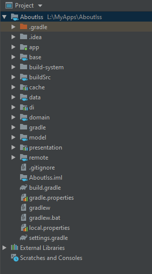

# Gradle Kotlin DSL

O Gradle lançou suporte a scripts em Kotlin e Kotlin DSL (DSL faz com que o código seja mais legível, criado em uma feature Kotlin), evitando o uso do Groovy.

Vantagens dos scripts em Kotlin:

- Preenchimento automático
- Assistente de conteúdo
- Navegação para fonte
- Suporte a extensões do Kotlin
- Erros no momento da compilação ao invés do tempo de execução
- Para modularização: melhora a organização e controle de dependências


## Implementação

A implementação deste projeto será considerando Clean Architecture, conforme a estrutura abaixo:



O projeto usado como base é o [AboutIss](https://github.com/ninalofrese/AboutIss)

### build.gradle (projeto)

```kotlin
buildscript {
    repositories {
        google()
        jcenter()

    }
    dependencies {
      //esses vão ficar vermelhos porque ainda não temos a implementação da classe de dependências
        classpath CoreDependencies.gradleAndroid
        classpath CoreDependencies.gradleKotlin
    }
}

allprojects {
    repositories {
        google()
        jcenter()

    }
}

task clean(type: Delete) {
    delete rootProject.buildDir
}
```


### Directory build-system

Crie um diretório chamado `build-system` na raiz do projeto. Crie um arquivo chamado `android-module.gradle` dentro desta pasta e adicione algo baseado no exemplo:

```kotlin
apply plugin: 'kotlin-android'
apply plugin: 'kotlin-android-extensions'
apply plugin: 'kotlin-kapt'

repositories {
    google()
    jcenter()
    maven { url "https://jitpack.io" }
    maven { url 'https://maven.fabric.io/public' }
    mavenCentral()
}

android {
	//Todas essas BuildVersions ficarão vermelhas por enquanto
    compileSdkVersion BuildVersions.compileSdk
    buildToolsVersion BuildVersions.buildTools

    defaultConfig {
        minSdkVersion BuildVersions.minSdk
        targetSdkVersion BuildVersions.targetSdk
        testInstrumentationRunner "androidx.test.runner.AndroidJUnitRunner"
    }

    buildTypes {
      //variações de build do app, coloque homolog aqui também se precisar
        debug {
            manifestPlaceholders = [applicationLabel: " - Staging"]
            versionNameSuffix "-debug"
            buildConfigField "String", "BASE_URL", BASE_URL
            debuggable true
            minifyEnabled false
        }

        release {
            manifestPlaceholders = [applicationLabel: ""]
            debuggable false
            minifyEnabled true
            buildConfigField "String", "BASE_URL", BASE_URL
        }
    }

    compileOptions {
        sourceCompatibility JavaVersion.VERSION_1_8
        targetCompatibility JavaVersion.VERSION_1_8
    }

    packagingOptions {
        exclude 'LICENSE.txt'
        exclude 'META-INF/DEPENDENCIES'
        exclude 'META-INF/ASL2.0'
        exclude 'META-INF/NOTICE'
        exclude 'META-INF/LICENSE'
        exclude 'META-INF/main.kotlin_module'
    }

    kotlinOptions {
        jvmTarget = '1.8'
    }

}

```

### Module buildSrc 

É nesse módulo que criaremos o script principal do Kotlin. O módulo **buildSrc** deve ser criado como um Módulo Java na raiz do projeto. Dentro dele, direto na raiz, precisará ser criado o `build.gradle.kts`.

```kotlin
import org.gradle.kotlin.dsl.`kotlin-dsl`

repositories {
    jcenter()
}

plugins {
    @Suppress("RemoveRedundantBackticks")
    `kotlin-dsl`
}

```

E também o arquivo `variables.gradle`, que vai conter algumas Strings para configuração do `android-module.gradle`:

```
ext.STRING = "String"
ext.BASE_URL = "BASE_URL"
```

Além disso, esse módulo contém mais arquivos importantes, um que contém todas as dependências do projeto, e outro que contém as versões das dependências. Eles precisam ser criados no caminho `buildSrc/src/main/java`. Sério, isso foi a única coisa que me travou porque acabei colocando dentro do meu pacote que ficava dentro de java, e o Gradle não vai reconhecer essas classes.

Ok, primeiro crie um arquivo `dependencies.kt`:

```kotlin
object CoreDependencies {
    val gradleAndroid = "com.android.tools.build:gradle:${BuildVersions.androidGradle}"
    val gradleKotlin = "org.jetbrains.kotlin:kotlin-gradle-plugin:${Kotlin.version}"
    val navigationSafe =
        "androidx.navigation:navigation-safe-args-gradle-plugin:${Versions.navigation}"
    val googlePlay = "com.google.gms:google-services:${BuildVersions.googleServices}"
    val fabric = "io.fabric.tools:gradle:${BuildVersions.fabric}"
    val gradleVersions =
        "com.github.ben-manes:gradle-versions-plugin:${BuildVersions.gradleVersions}"
}

object Dependencies {
    val kotlinStdLib = "org.jetbrains.kotlin:kotlin-stdlib-jdk8:${Kotlin.version}"


    val retrofit = "com.squareup.retrofit2:retrofit:${Versions.retrofit}"
    val gson = "com.google.code.gson:gson:${Versions.gson}"
    val gsonConverter = "com.squareup.retrofit2:converter-gson:${Versions.retrofit}"
    val okhttp = "com.squareup.okhttp3:okhttp:${Versions.okHttp}"
    val okhttpLogger =
        "com.squareup.okhttp3:logging-interceptor:${Versions.okHttpLoggingInterceptor}"
		
  	//aqui vão todas as dependências mais comuns do projeto
    
}

object TestDependencies {
    val jUnit = "androidx.test.ext:junit:${TestVersions.androidxJunit}"
    val assertJ = "org.assertj:assertj-core:${TestVersions.assertJ}"
    val mockk = "io.mockk:mockk:${TestVersions.mockk}"
    val coroutinesTest =
        "org.jetbrains.kotlinx:kotlinx-coroutines-test:${TestVersions.coroutinesTest}"
    val mockkAndroid = "io.mockk:mockk-android:${TestVersions.mockkAndroid}"

    val roomTesting = "androidx.room:room-testing:$${Versions.room}"

    val mockitoKotlin = "com.nhaarman.mockitokotlin2:mockito-kotlin:${TestVersions.mockitoKotlin}"

    val androidTestCore = "androidx.test:core:${TestVersions.androidTestArchCore}"
    val androidTestRunner = "androidx.test:runner:${TestVersions.androidTextRunner}"
    val androidTestRules = "androidx.test:rules:${TestVersions.androidTextRules}"
    val espresso = "androidx.test.espresso:espresso-core:${TestVersions.espresso}"
    val coreTesting = "androidx.arch.core:core-testing:${TestVersions.coreTesting}"
    val mockWebServer = "com.squareup.okhttp3:mockwebserver:${Versions.okHttp}"
}

object AndroidModule {
    val main = listOf(
        Dependencies.kotlinStdLib,
        Dependencies.appCompat,
        Dependencies.lifeCycle,
        Dependencies.navigationFragment,
        Dependencies.navigationUiKtx,
        Dependencies.cardView,
        Dependencies.recyclerView,
        Dependencies.materialDesign,
        Dependencies.koin,
        Dependencies.koinAndorid,
        Dependencies.koinViewModel
    )

    val room = listOf(
        Dependencies.room,
        Dependencies.roomCompiler,
        Dependencies.roomRxJava
    )

    val retrofit = listOf(
        Dependencies.retrofit,
        Dependencies.gson,
        Dependencies.gsonConverter,
        Dependencies.okhttp,
        Dependencies.okhttpLogger
    )

    val firebase = listOf(
        Dependencies.firebaseCore,
        Dependencies.firebaseAnalytics,
        Dependencies.firebaseCrashlytics
    )

    val unitTesting = listOf(
        TestDependencies.jUnit,
        TestDependencies.assertJ,
        TestDependencies.mockk,
        TestDependencies.coroutinesTest,
        TestDependencies.coreTesting
    )

    val androidTesting = listOf(
        TestDependencies.androidTestCore,
        TestDependencies.androidTestRules,
        TestDependencies.androidTestRunner,
        TestDependencies.mockkAndroid,
        TestDependencies.espresso
    )
}
```

Agora o arquivo `versions.kt`:

```kotlin
internal object Kotlin {
    const val version = "1.3.61"
}

internal object BuildVersions {
    const val androidGradle = "3.5.2"
    const val compileSdk = 29
    const val buildTools = "29.0.2"
    const val minSdk = 21
    const val targetSdk = compileSdk
    const val googleServices = "4.3.2"
    const val fabric = "1.31.0"
    const val gradleVersions = "0.27.0"
}

internal object Versions {

    const val koin = "2.0.1"

    const val supportLibrary = "1.1.0"
    const val cardView = "1.0.0"
    const val recyclerView = "1.0.0"
    const val material = "1.1.0-alpha04"
    const val androidxCore = "1.1.0"
    const val constraintLayout = "1.1.2"
    const val workerManager = "2.2.0"
    const val gson = "2.8.5"
    const val okHttp = "4.2.0"
    const val okHttpLoggingInterceptor = okHttp
    const val retrofit = "2.6.1"

		//todas as versões das dependências declaradas no dependencies.kt
}

internal object TestVersions {
    const val assertJ = "3.11.1"
    const val coroutinesTest = "1.3.2"
    const val mockk = "1.9.3"
    const val mockkAndroid = mockk
    const val androidxJunit = "1.1.1"
    const val espresso = "3.2.0"
    const val androidTestArchCore = "1.0.0"
    const val androidTextRules = "1.1.0"
    const val androidTextRunner = "1.1.0"
    const val coreTesting = "2.1.0"
    val mockitoKotlin = "2.0.0-RC3"
}

```

Como esses arquivos são bem longos, a versão completa desses arquivos pode ser encontrada no [link](https://github.com/ninalofrese/AboutIss/tree/master/buildSrc/src/main/java).

> É importante que os arquivos do módulo `BuildSrc` estejam dentro apenas de uma pasta `java`, sem incluir caminho do pacote.

### Módulos Kotlin

Os módulos Kotlin são criados na pasta raiz do projeto com botão direito > New > Module > Java Library > Next > e nomear o módulo. Geralmente, eu deixo o .gitignore gerado, mas depois disso eu acabo deletando a classe que ele cria.

O importante aqui é que o build.gradle é diferente dependendo do tipo de módulo que ele está. Em um módulo Android, ele terá dependências de coisas do Android e aqui em um módulo Kotlin não. Seguindo a Clean Architecture, alguns módulos não precisam ser do tipo Android, pois possuem essencialmente camadas lógicas e não de features do Android. São esses os módulos que mantive como Kotlin: **base, data, domain, model e remote**, além do buildSrc que é um módulo Kotlin, só que tratamos de forma especial.

```kotlin
//exemplo do build.gradle do módulo base, que inclui o java-library porque o base concentra a base dos libraries
apply plugin: 'java-library'
apply plugin: 'kotlin'

dependencies {
  //somente as dependências necessárias
    implementation Dependencies.kotlinStdLib
    implementation Dependencies.rxJava
    implementation Dependencies.rxKotlin

    implementation Dependencies.retrofit
    implementation Dependencies.gson
    implementation Dependencies.gsonConverter
    implementation Dependencies.rxJavaRetrofit
    implementation Dependencies.okhttp
    implementation Dependencies.okhttpLogger
}
```

```kotlin
//exemplo do build.gradle do módulo domain
apply plugin: 'kotlin'

dependencies {
    implementation project(":base")
    implementation project(":model")
    implementation Dependencies.kotlinStdLib
    implementation Dependencies.rxJava
    implementation Dependencies.rxKotlin
    implementation Dependencies.koin
    testImplementation TestDependencies.mockitoKotlin
    testImplementation TestDependencies.jUnit
    testImplementation TestDependencies.assertJ
}
//inclui o Java 8, mesmo sendo arquivos em Kotlin
sourceCompatibility = JavaVersion.VERSION_1_8
targetCompatibility = JavaVersion.VERSION_1_8

```

```kotlin
//exemplo do build.gradle do data
apply plugin: 'kotlin'

dependencies {
  //conhece os módulos que precisa
    implementation project(":base")
    implementation project(":model")
    implementation project(":domain")

    implementation Dependencies.kotlinStdLib

    implementation Dependencies.rxJava
    implementation Dependencies.rxKotlin

    implementation Dependencies.koin

    testImplementation TestDependencies.mockitoKotlin
    testImplementation TestDependencies.jUnit
    testImplementation TestDependencies.assertJ
}

sourceCompatibility = JavaVersion.VERSION_1_8
targetCompatibility = JavaVersion.VERSION_1_8

```

```kotlin
//exemplo do build.gradle do model, com as interfaces dos modelos utilizados nas outras camadas
apply plugin: 'java-library'
apply plugin: 'kotlin'

dependencies {
    implementation Dependencies.kotlinStdLib
}

sourceCompatibility = "8"
targetCompatibility = "8"

```

### Módulos Android

Assim como nos módulos Kotlin, os módulos Android precisam ser ajustados para somente trazer as dependências necessárias. De acordo com o Clean Architecture, criei os seguintes módulos como Android: **cache, di e presentation**. 

```kotlin
//exemplo do build.gradle do módulo cache
apply plugin: 'com.android.library'
apply from:"../build-system/android-module.gradle"

dependencies {

    implementation project(":base")
    implementation project(":model")
    implementation project(":data")

    implementation Dependencies.kotlinStdLib
    implementation Dependencies.appCompat
    implementation Dependencies.androidxCore
    implementation Dependencies.pagging
    implementation Dependencies.rxJava
    implementation Dependencies.rxKotlin
    implementation Dependencies.rxAndroid

    implementation Dependencies.room
    kapt Dependencies.roomCompiler
    implementation Dependencies.roomRxJava

    implementation Dependencies.koin
    implementation Dependencies.koinAndorid

    testImplementation TestDependencies.mockitoKotlin
    testImplementation TestDependencies.jUnit
    testImplementation TestDependencies.assertJ
}
```

```kotlin
//exemplo do build.gradle do módulo di - injeção de dependência via koin
apply plugin: 'com.android.library'
apply from:"../build-system/android-module.gradle"

dependencies {
		//ele precisa conhecer todos os outros módulos
    implementation project(":presentation")
    implementation project(":domain")
    implementation project(":data")
    implementation project(":remote")
    implementation project(":cache")

    implementation Dependencies.kotlinStdLib
    implementation Dependencies.appCompat
    implementation Dependencies.androidxCore

    implementation Dependencies.koin
    implementation Dependencies.koinViewModel
}

```

```kotlin
//exemplo do build.gradle do módulo presentation
apply plugin: 'com.android.library'
apply from:"../build-system/android-module.gradle"

dependencies {
    implementation fileTree(dir: 'libs', include: ['*.jar'])

    implementation project(":domain")
    implementation project(":model")
    implementation project(":base")

    implementation Dependencies.kotlinStdLib
    implementation Dependencies.appCompat
    implementation Dependencies.androidxCore
    implementation Dependencies.rxJava
    implementation Dependencies.rxKotlin
    implementation Dependencies.rxAndroid

    implementation Dependencies.koin
    implementation Dependencies.koinViewModel

    testImplementation TestDependencies.mockitoKotlin
    testImplementation TestDependencies.jUnit
    testImplementation TestDependencies.assertJ
}

```


### Módulo app

É neste módulo que geralmente ocorrem as personalizações a nível de Application, então ele meio que contém boa parte do corpo de um build.gradle. Além disso, a extensão deste exemplo abaixo ocorre por conta da camada de UI (views) estarem neste módulo, o que não necessariamente precisa acontecer.

```kotlin
//exemplo do build.gradle do app
apply plugin: 'com.android.application'
apply plugin: 'kotlin-android'
apply plugin: 'kotlin-android-extensions'
apply plugin: 'kotlin-kapt'

repositories {
    google()
    jcenter()
    maven { url 'https://maven.fabric.io/public' }
    mavenCentral()
}

android {
    compileSdkVersion BuildVersions.compileSdk
    buildToolsVersion BuildVersions.buildTools
    defaultConfig {
        applicationId "" //INSERT APPLICATION ID HERE
        minSdkVersion BuildVersions.minSdk
        targetSdkVersion BuildVersions.targetSdk
        versionCode 1
        versionName "1.0"
        testInstrumentationRunner "androidx.test.runner.AndroidJUnitRunner"
    }
    buildTypes {
        debug {
            manifestPlaceholders = [applicationLabel: "GitHubSearch - Staging"]
            versionNameSuffix "-debug"
            applicationIdSuffix ".debug"
            debuggable true
            minifyEnabled false
//            signingConfig signingConfigs.debug
            buildConfigField "String", "BASE_URL", BASE_URL
        }

        release {
            manifestPlaceholders = [applicationLabel: "GitHub Search"]
            debuggable false
            minifyEnabled true
//            signingConfig signingConfigs.release
            proguardFiles getDefaultProguardFile('proguard-android-optimize.txt'), 'proguard-rules.pro'
            buildConfigField "String", "BASE_URL", BASE_URL
        }
    }
}
//importante parte para fazer a compilação na JVM
tasks.withType(org.jetbrains.kotlin.gradle.tasks.KotlinCompile).all {
    kotlinOptions {
        jvmTarget = "1.8"
    }
}

dependencies {
    implementation fileTree(dir: 'libs', include: ['*.jar'])
    implementation project(":di")
    implementation project(":presentation")
    implementation project(":base")
    implementation project(":model")
    implementation Dependencies.kotlinStdLib
    implementation Dependencies.appCompat
    implementation Dependencies.materialDesign
    implementation Dependencies.cardView
    implementation Dependencies.constraintLayout
}

```


# Links

https://medium.com/mindorks/migrating-gradle-build-scripts-to-kotlin-dsl-89788a4e383a

https://github.com/gradle/kotlin-dsl-samples

https://docs.gradle.org/current/userguide/kotlin_dsl.html

