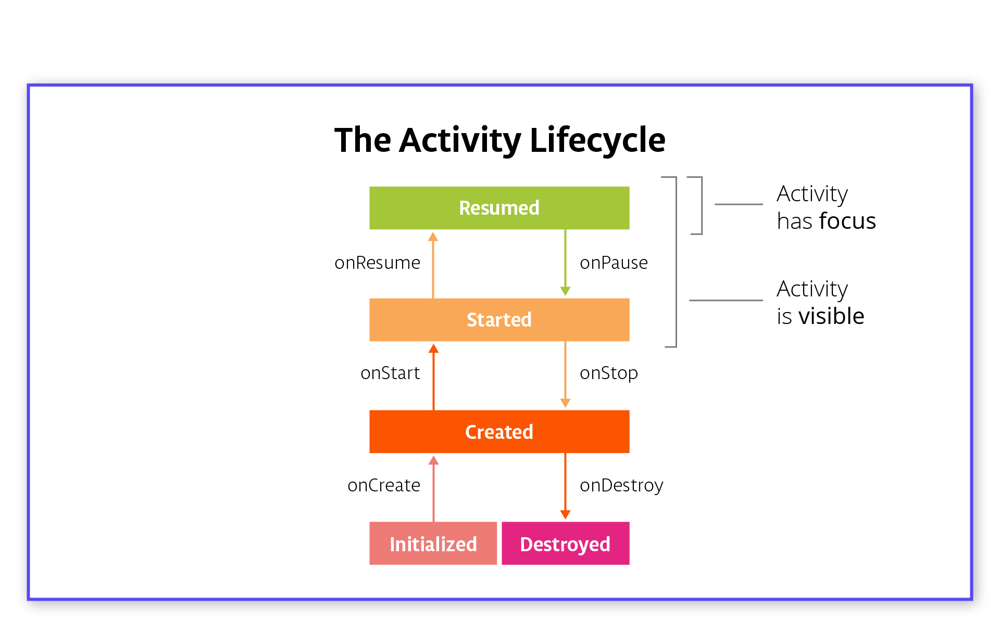

# General Definitions

**Visible Lifecycle:** The part of the Lifecycle between onStart and onStop when the Activity is visible.

**Focus:** An Activity is said to have focus when it's the activity the user can interact with.

**Foreground:** When the activity is on screen.

**Background:** When the activity is fully off screen, it is considered in the background.

# Lifecycle States

These are the same for both the Fragment Lifecycle and the Activity Lifecycle.

**Initialized:** This is the starting state whenever you make a new activity. This is a transient state -- it immediately goes to Created.

**Created:** Activity has just been created, but it’s not visible and it doesn’t have focus (you’re not able to interact with it).

**Started:** Activity is visible but doesn’t have focus.

**Resumed:** The state of the activity when it is running. It’s visible and has focus.

**Destroyed:** Activity is destroyed. It can be ejected from memory at any point and should not be referenced or interacted with.

# Activity Lifecycle Callbacks

**onCreate:** This is called the first time the activity starts and is therefore only called once during the lifecycle of the activity. It represents when the activity is created and initialized. The activity is not yet visible and you can't interact with it. You must implement onCreate. In onCreate you should:

- Inflate the activity's UI, whether that's using findViewById or databinding.
- Initialize variables.
- Do any other initialization that only happens once during the activity lifetime.

**onStart:** This is triggered when the activity is about to become visible. It can be called multiple times as the user navigates away from the activity and then back. Examples of the user "navigating away" are when they go to the home screen, or to a new activity in the app. At this point, the activity is not interactive. In onStart you should:

- Start any sensors, animations or other procedures that need to start when the activity is visible.

**onResume:** This is triggered when the activity has focus and the user can interact with it. Here you should:

- Start any sensors, animations or other procedures that need to start when the activity has focus (the activity the user is currently interacting with).

**onPause:** The mirror method to onResume. This method is called as soon as the activity loses focus and the user can't interact with it. An activity can lose focus without fully disappearing from the screen (for example, when a dialog appears that partially obscures the activity). Here you should:

- Stop any sensors, animations or other procedures that should not run when the activity doesn't have focus and is partially obscured.
- Keep execution fast. The next activity is not shown until this completes.

**onStop:** This is the mirror method to onStart. It is called when you can no longer see the activity. Here you should:

- Stop any sensor, animations or other procedures that should not run when the activity is not on screen.
- You can use this to persist (permanently save) data, which you’ll be learning more about in Lesson 6
- Stop logic that updates the UI. This should not be running when the activity is off-screen; it's a waste of resources.
- There are also restrictions as soon as the app goes into the background, which is when all activities in your app are in the background. We'll talk more about this in Lesson 9.

**onDestroy:** This is the mirror method to onCreate. It is called once when the activity is fully destroyed. This happens when you navigate back out of the activity (as in press the back button), or manually call finish(). It is your last chance to clean up resources associated with the activity. Here you should:

- Tear down or release any resources that are related to the activity and are not automatically released for you. Forgetting to do this could cause a memory leak! Logic that refers to the activity or attempts to update the UI after the activity has been destroyed could crash the app!

# Summary of the Fragment Lifecycle

Fragments also have lifecycle states that they go between. The lifecycle states are the same as the activity states. You’ll notice that in your Android Trivia app, you’re using the onCreateView callback - while the fragment lifecycle states are the same, **the callbacks are different**.

A deep dive into the fragment lifecycle could be a lesson in itself. Here, we’ll just cover the basics with the summary below:

## Important Fragment Callbacks to Implement

**onCreate:** Similar to the Activity’s onCreate callback. This is when the fragment is created. This will only get called once. Here you should:

- Initialize anything essential for you fragment.
- **DO NOT inflate XML**, do that in onCreateView, when the system is first drawing the fragment NOT reference the activity, it is still being created. Do this in onActivityCreated.

**onCreateView:** This is called between onCreate and onActivityCreated. when the system will draw the fragment for the first time when the fragment becomes visible again. You must return a view in this callback if your fragment has a UI. Here you should:

- Create your views by inflating your XML.

**onStop:** Very similar to Activity’s onStop. This callback is called when the user leaves your fragment. Here you should:

- Save any permanent fragment state (this will be discussed in lesson 6)

## Other callbacks

**onAttach:** When the fragment is first attached to the activity. This is only called once during the lifecycle of the fragment.

**onActivityCreated:** Called when the activity onCreate method has returned and the activity has been initialized. If the fragment is added to an activity that's already created, this still gets called. It's purpose is to contain any code the requires the activity exists and it is called multiple times during the lifecycle of the fragment. Here you should:

- Execute any code that requires an activity instance

**onStart:** Called right before the fragment is visible to the user.

**onResume:** When the activity resumes the fragment. This means the fragment is visible, has focus and is running.

**onStop:** Called when the Activity’s onStop is called. The fragment no longer has focus.

**onDestroyView:** Unlike activities, **fragment views are destroyed every time they go off screen**. This is called after the view is no longer visible.

- Do not refer to views in this callback, since they are destroyed

**onDestroy:** Called when the Activity’s onDestroy is called.

**onDetach:** Called when the association between the fragment and the activity is destroyed.

# Lifecycle Cheat sheets

What you’ve seen up to this point are the Activity Lifecycle and the Fragment Lifecycle for a single Activity or Fragment. For more complicated apps, it becomes important to understand the interactions between Activity and Fragment life cycles and multiple activities. This is outside of the scope of this lesson, but there are a series of excellent blog posts and cheat sheets posted by Googler which are helpful references for this:

- [**The Android Lifecycle cheat sheet — part I: Single Activity**](https://medium.com/androiddevelopers/the-android-lifecycle-cheat-sheet-part-i-single-activities-e49fd3d202ab) - This is a visual recap of much of the material here.
- [**The Android Lifecycle cheat sheet — part II: Multiple Activities**](https://medium.com/androiddevelopers/the-android-lifecycle-cheat-sheet-part-ii-multiple-activities-a411fd139f24) - This shows the order of lifecycle calls when two activities interact.
- [**The Android Lifecycle cheat sheet — part III: Fragments**](https://medium.com/androiddevelopers/the-android-lifecycle-cheat-sheet-part-iii-fragments-afc87d4f37fd) - This show the order of lifecycle calls when an activity and fragment interact.

Link do vídeo:

https://youtu.be/efYCAKJBq5k
