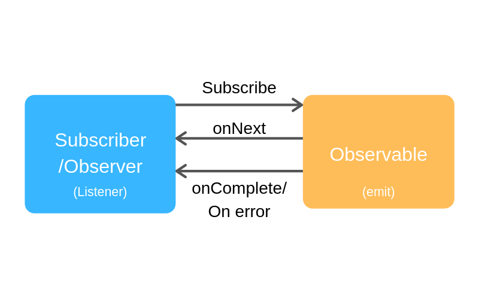
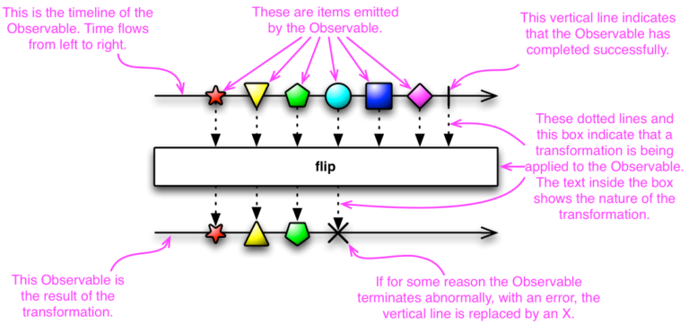

# RxJava

RxJava é um framework enorme com várias nuances, abordando múltiplas implementações. É o principal framework quando se fala de programação reativa, e o Rx é utilizado não somente em Java, como em outras linguagens e plataformas.


- [RxJava](https://github.com/ReactiveX/RxJava/wiki) é a base do framework e suporta Java6+ e também outras linguagens baseadas na JVM como Groovy, Clojure, JRuby, Kotlin e Scala.
- RxAndroid oferece melhor integração com classes Android, adicionando suporte básico. Basicamente provê um `Scheduler`  que agenda na main thread ou em qualquer  `Looper` fornecido. Além disso, pode ser plugada a outras [extensões](https://github.com/ReactiveX/RxAndroid/wiki#extensions) para casos mais específicos, como DataBinding, Lifecycle, Notification ou Wear.
- RxKotlin adiciona [extensions functions](https://github.com/ReactiveX/RxKotlin#extensions) no RxJava


```groovy
implementation 'io.reactivex.rxjava3:rxjava:3.0.0'
implementation 'io.reactivex.rxjava3:rxandroid:3.0.0'
implementation 'io.reactivex.rxjava3:rxkotlin:3.x.y'
```


| Vantagens                                                    | Desvantagens                                                 |
| ------------------------------------------------------------ | ------------------------------------------------------------ |
| Usa composition de Observable ao invés de herança            | Diferente modelo mental ("tudo é um stream")                 |
| API muito rica e tem suporte a muitos casos de uso por padrão | API muito rica, por isso uma curva de aprendizado longa, levando a erros de uso de operadores |
| Fluxos complexos com múltiplas threads sem ter que lidar com multithreading primitives | Intrusivo                                                    |
| Menos linhas de código                                       | Conhecimento de RxJava é preciso para ler o código           |


## Observable/ Observer

O RxJava usa o padrão Observer, um conceito que se resume em **Observable** e **Observer**.

O **Observable** é a fonte de dados de um fluxo reativo. Ele só começa a distribuir os dados quando um observer se inscreve a este observable, ou seja, no `subscribe()`. Um observable pode ter vários observers.

O **Observer** é o receptor do fluxo reativo. Se o observable emite um novo elemento, o método `onNext()` é invocado em cada observador. Se o observable termina esse fluxo, o `onComplete()`é chamado, mas se o fluxo é interrompido com um erro, o `onError()` é chamado em cada observer.

Esses conceitos são então adicionados aos **operadores**, iniciando na origem (observable) e terminando no consumidor (observer). Os operadores são aplicados em qualquer parte desse fluxo entre observables e observers. Eles podem criar novos observables, filtrar, transformar, combinar, realizar operações condicionais e matemáticas, e muito mais. A [documentação sobre operadores](http://reactivex.io/documentation/operators.html) é extensa e abrange em detalhes cada um deles, além de trazer um guia que ajuda a decidir os operadores ideais para diferentes casos de uso.

(Observable) emite itens > (Operadores) transformam e filtram esses itens > (Observers) observam e reagem a essas sequências



O esquema abaixo auxilia no entendimento dos *Marble Diagrams* presentes em toda a [documentação do ReactiveX](http://reactivex.io).




> `Callable` é como o `Runnable`, mas que retornam alguma coisa


### Criando um Observable

Um Observable pode ser criado de forma manual, usando o método `create()`, ou a partir de estruturas prontas, com os métodos `just()`, `from()` e `defer()`, que são operadores de criação de observables.

- [Criando um Observable de uma estrutura existente](https://github.com/ReactiveX/RxJava/wiki/Creating-Observables)
- [Criando um Observable manualmente](https://github.com/ReactiveX/RxJava/wiki/How-To-Use-RxJava#creating-an-observable-via-the-create-method)


### Hot e cold Observables

- Um observable "cold" espera até que um observer se subscreva antes de emitir itens, então é garantido que o observador veja toda a sequência desde o começo. Na maioria das vezes, a implementação necessária é mesmo o cold.
- Um observable "hot" pode começar a emitir items assim que é criado, assim qualquer observer que depois se subscrever pode começar a observar a sequência no meio, usando por exemplo um [ConnectableObservable](https://medium.com/tompee/rxjava-ninja-hot-and-cold-observables-19b30d6cc2fa).


## Variantes de Observable

O framework disponibiliza algumas variações de Observable:


### Single

Pode gerar um único item ou gera um evento de erro. Essa é uma invocação do framework para um método do Java.

### Maybe

Pode gerar um único evento, ou nenhum evento, ou pode gerar um evento de erro. Essa é a versão do framework para o tipo de dado `Optional` do Java.

### Completable

Sempre termina gerando um evento de conclusão ou erro, mas não emite nenhum dado. Essa é a versão responsiva do `Runnable` no Java.

### Observable

Pode emitir 0 ou n elementos, e terminar com sucesso ou erro.

### Flowable

Pode emitir 0 ou n elementos, e termina com sucesso ou erro. Tem suporte a [**backpressure**](http://reactivex.io/documentation/operators/backpressure.html) permitindo que controle a velocidade que a fonte gera os dados, evitando travamentos por um fluxo de dados maior do que um observer pode suportar.


## Disposable

Quando um observer se subscreve em um observable, é criada uma stream. Esse stream consome recursos que, mais tarde, se tornam um "resíduo sólido" descartável. É preciso lidar com esse lixo se o stream for rodar por muito tempo.

Por padrão, o Observable tem um método `onComplete()` que vai liberar o lixo quando for chamado. Mas muitas vezes é mais vantajoso e conveniente ter a possibilidade de cancelar as subscriptions facilmente e a qualquer hora.

O `Disposable` é um stream ou um link entre o Observable e o Observer. Olhando na [documentação](http://reactivex.io/RxJava/javadoc/io/reactivex/disposables/Disposable.html), mostra que ele tem 2 métodos, `dispose()` e `isDisposed()`. O primeiro se livra do link, enquanto o último checa se o link foi livrado.

Conforme um app evolui, tem cenários que contém mais de uma subscrição. Para esses casos, o **CompositeDisposable** gerencia os recursos. Ele implementa `Disposable` e depois detém uma coleção de disposables. No caso do CompositeDisposable tem uma distinção do `dispose()` e `clear()`.

- O **clear** se livra de todas as subscriptions que foram adicionadas anteriormente e limpa as listas. Contudo, você ainda pode chamar `add()`depois e adicionar novos disposables de novo.
- O **dispose** faz o mesmo, mas chamar o `add()` depois não faz nada, evitando que adicione acidentalmente novos diposables. No Java, precisa checar se ele é *null*.


```kotlin
class ExampleViewModel : ViewModel() {
    private val compositeDisposable = CompositeDisposable()
    fun doSomething() {
        val disposable = Single.just(1)
            .subscribe { 
                //update something onNext
            }
        compositeDisposable.add(disposable)
    }
  
    override fun onCleared() {
        compositeDisposable.clear()
    }
}
```


Dá também para fazer uma abstração dessa *ViewModel*, assim ele 

```kotlin
abstract class DisposingViewModel : ViewModel() {
    private val compositeDisposable = CompositeDisposable()
    fun addDisposable(disposable: Disposable) {
        compositeDisposable.add(disposable)
    }
    override fun onCleared() {
        compositeDisposable.dispose()
    }
}
```


## Operadores

É nos operadores onde mora boa parte da complexidade do RxJava. Quando se somam operadores que fazem coisas similares junto com a questão de simultaneidade do stream, torna o RxJava um monstro que, dependendo de como está codificado, fica bem difícil de entender.

Não vou passar por cada operador do RxJava, mas vou destacar algumas particularidades deles.


A diferença dos operadores **flat**, como por exemplo `switchMap`, `concatMap`, `flatMap` e outros, é que cada valor emitido do observable é mapeado para outro observable. O observable interno é então "elevado" para o fluxo principal, de modo que o que sai de uma operação flat é sempre o observable interno. É diferente das suas versões mais "simples", como o `map`, que recebe um valor e emite um novo valor, não um observável.


Links sobre operadores:

- [Lista alfabética de operadores - Github do RxJava](https://github.com/ReactiveX/RxJava/wiki/Alphabetical-List-of-Observable-Operators)
- [Diferença entre concatMap e flatMap](https://fernandocejas.com/2015/01/11/rxjava-observable-tranformation-concatmap-vs-flatmap/)
- [Documentação sobre operadores](http://reactivex.io/documentation/operators.html)


# Exemplos


## 1000 threads

```java
public Observable<Result> startBenchmark() {
  return Flowable.range(0, NUM_OF_MESSAGES)
    .flatMap(id -> Flowable
             .fromCallable(() -> {
               try {
                 Thread.sleep(DefaultConfiguration.DEFAULT_PRODUCER_DELAY_MS);
               } catch (InterruptedException e) {
                 return id;
               }
               mBlockingQueue.put(id);
               return id;
             }) // <-- generate message
             .subscribeOn(Schedulers.io())
            )
    //seta a concorrência de consumers/ observadores
    .parallel(NUM_OF_MESSAGES)
    .runOn(Schedulers.io())
    .doOnNext(msg -> { mBlockingQueue.take(); })  // <-- process message
    .sequential()
    .count()
    .doOnSubscribe(s -> { mStartTimestamp = System.currentTimeMillis(); })
    .map(cnt -> new Result(System.currentTimeMillis() - mStartTimestamp, cnt.intValue()))
    .toObservable();
}
```


## 2 requests sequenciais

```java
public void getRoute(Long id) {
  disposable.add(
    routeRepository.getSearchById(getApplication().getApplicationContext(), id)
    .flatMap(search1 -> {
      return routeRepository.getRoute(search1.getRequest().getPlaces(), search1.getRequest().getFuelConsumption(), search1.getRequest().getFuelPrice());
    }, (search1, routeResponse1) -> {
      return new Pair<>(routeResponse1, priceRepository.getPrices(search1.getAxis(), routeResponse1.getDistance() / 1000, false).blockingFirst());
    })
    .map(pair -> {
      saveRouteOnDatabase(id, pair.first);
      savePriceOnDatabase(id, pair.second);
      return pair;
    })
    .subscribeOn(Schedulers.io())
    .observeOn(AndroidSchedulers.mainThread())
    .doOnSubscribe(disposable1 -> {
      loading.setValue(true);
    })
    .doOnTerminate(() -> {
      loading.setValue(false);
    })
    .subscribe(pair -> {
      routeResponse.setValue(pair.first);
      priceResponse.setValue(pair.second);
      loading.setValue(false);
    }, throwable -> {
      error.setValue(throwable.getMessage());
    })

  );
}
```

[Esse exemplo veio do Case que fiz](https://github.com/ninalofrese/Android-Case/blob/ninalofrese/fretecalc/app/src/main/java/com/example/fretecalc/viewmodels/ResultActivityViewModel.java)


## Chamar o request 2 vezes

O operador `concatMap` transforma os itens emitidos por um Observable em Observables, então "nivela" (*flatten*) em um único observable, sem intercalação. No exemplo abaixo, quero repetir a chamada de um quando outro é terminado.

```kotlin
override fun buildUseCaseFlowable(params: Unit?): Flowable<List<VehicleCategory>> {
  return repository.getVehicleTypes().concatMap {
    repository.getVehicleTypes()
  }.map {
    FilterByVehicleCategory.filter(it)
  }
}
```


# Links

- [Documentação do RxJava](http://reactivex.io)
- [RxJava no Github - com informações na Wiki também](https://github.com/ReactiveX/RxJava)
- [Gerenciando disposables em RxJava 2](https://medium.com/the-kotlin-chronicle/managing-disposables-in-rxjava-2-the-less-bad-version-b3ff2b0b72a2)
- [Por que estou usando RxJava na minha aplicação?](https://medium.com/movile-tech/por-que-estou-usando-rxjava-na-minha-aplica%C3%A7%C3%A3o-android-47dc2fd21623)
- [Exemplo de 2 chamadas encadeadas - Case](https://github.com/ninalofrese/Android-Case/blob/ninalofrese/fretecalc/app/src/main/java/com/example/fretecalc/viewmodels/ResultActivityViewModel.java)
- [Hot e cold observables](https://medium.com/tompee/rxjava-ninja-hot-and-cold-observables-19b30d6cc2fa)
- [Caching com RxJava](https://blog.mindorks.com/implement-caching-in-android-using-rxjava-operators)