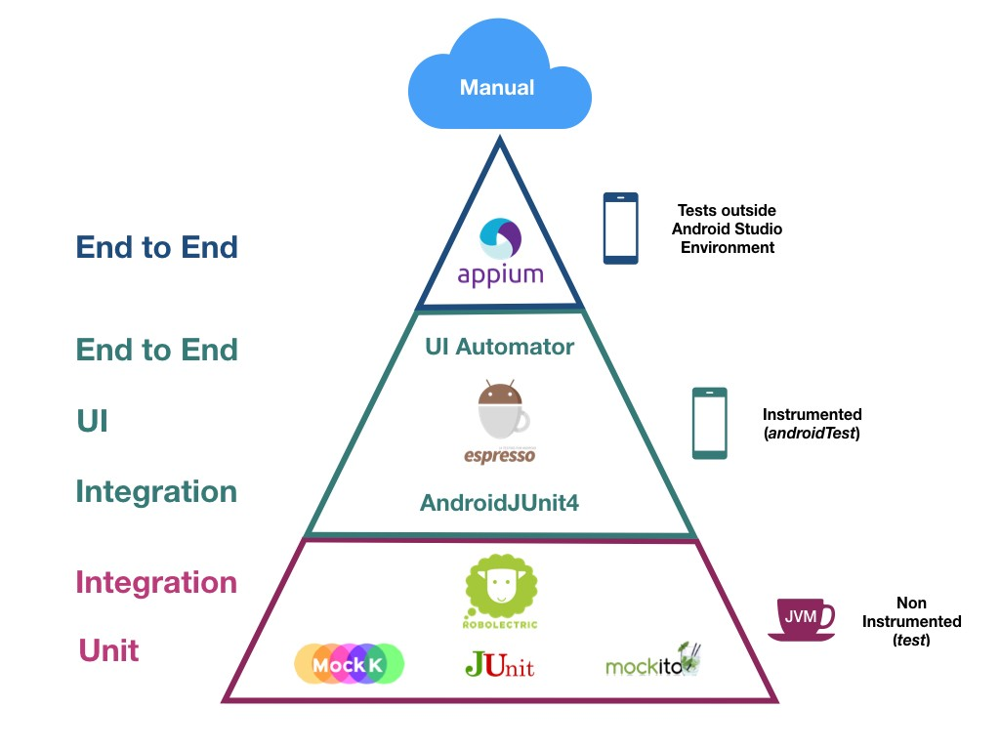

# Testes unitários

> Testes unitários devem testar a menor parte de um código isoladamente. A menor parte geralmente é um método e vários testes são necessários para diferentes casos de teste.

Os testes unitários são a base dos testes de toda a parte lógica do sistema Android, seguidos pelos testes de integração(UI), testes end-to-end e testes manuais.



Antes de começar:

> *System under test* (SUT) é um termo para "o que está sendo testado". No Android, cada arquivo de teste é vinculado a uma classe, portanto, o SUT é a classe a ser testada. O SUT não deve ser substituído por um test double (mocks ou stubs).


### Como fazer testes unitários?

O objetivo dos testes unitários é encontrar bugs nas classes de lógica e dados. Na hora de escrever os testes, é melhor não ver a implementação do código, para não ter um viés e acabar só escrevendo testes "perfeitos". Lembre-se, o objetivo é encontrar bugs, então é bom explorar as possibilidades de teste de cada método para encontrar problemas neste momento e poder fazer as correções.

1. Crie um arquivo de teste da classe que quer testar.
2. Faça o setup do *system under test (SUT)* no @Before.
3. Pense sobre as situações possíveis e identifique quais requerimentos podem ser cobertos pela unidade que vai testar. Faça uma lista como comentários e depois, escreva cada teste.
4. Leia o retorno de testes que não passaram e tente formular uma hipótese.
5. Faça a correção no código de produção.
6. Confira se todos os testes passaram.


### Como nomear testes unitários

Assim como em qualquer código, o nome dos testes unitários é muito importante. Neles, as regras normais de nomear métodos não se aplicam, mas ter atenção ao nomear pode ser decisivo na investigação e conserto de um testes que falhou.

Uma sugestão de padrão pode ser bem interessante para melhorar a leitura do teste:

`<unidadeDeTeste>_<estadoSobTeste>_<comportamentoEsperado>`

- Unidade de teste: geralmente é o nome do método a ser testado

- Estado sob teste/ casos de teste: Qual é o estado que está sendo testado? 
- Comportamento esperado: Qual é o comportamento esperado?


Exemplo:

```java
//No método reverse, quando for uma string vazia, retornar uma string vazia
@Test
public void reverse_emptyString_emptyStringReturned() throws Exception {
  String result = SUT.reverse("");
  assertThat(result, is(""));
}

//No método reverse, quando for um único caractere, retornar o mesmo caractere
@Test
public void reverse_singleCharacter_sameStringReturned() throws Exception {
  String result = SUT.reverse("a");
  assertThat(result, is("a"));
}

//No método reverse, quando for uma string maior, retornar a string invertida
@Test
public void reverse_longString_reversedStringReturned() throws Exception {
  String result = SUT.reverse("Vasiliy Zukanov");
  assertThat(result, is("vonakuZ yilisaV"));
}
```


### Como escolher os casos de teste

É muito fácil se perder ao olhar para um método e pensar: o que eu vou testar? Um bom exercício para criar testes é evitar olhar ao corpo do método e escrever o teste às cegas, assim você consegue visualizar as possibilidades de teste sem ser tendencioso.

Um bom primeiro passo é pegar a classe que vai testar e criar o arquivo de teste. Depois, tente anotar nos comentários as combinações possíveis de parâmetros que aquele método pode receber. Agrupe as combinações similares e reduza para os casos que representam melhor cada grupo. Escreva testes para cada um e, depois, rode o teste com **coverage**, é bem bacana ver o quanto o teste está rodando no código e quantas linhas cobre. Nesse momento dá para identificar quais casos o teste não está cobrindo. É bom lembrar que, mesmo que o teste esteja cobrindo 100% não é uma garantia que todos os estados possíveis estão sendo testados. Procure pensar em condições que fiquem no limite de diferentes grupos de entrada.

Em resumo:

- Identificar diferentes combinações de input, que correspondem a diferentes estados - anotar os comentários no arquivo de testes ajuda
- Escrever um caso de teste para um representante de cada grupo.
- 100% de *line coverage* é necessário, mas não o suficiente para garantir a cobertura de todas as funcionalidades possíveis para aquele caso de teste.
- Escreva casos de teste para condições que estão no limite entre diferentes grupos de entrada.

Exemplo:

```java
@Test
public void isOverlap_interval1BeforeAdjacentInterval2_falseReturned() throws Exception {
Interval interval1 = new Interval(-1, 5);
Interval interval2 = new Interval(5, 8);
boolean result = SUT.isOverlap(interval1, interval2);
assertThat(result, is(false));
}

@Test
public void isOverlap_interval1AfterAdjacentInterval2_falseReturned() throws Exception {
Interval interval1 = new Interval(-1, 5);
Interval interval2 = new Interval(-3, -1);
boolean result = SUT.isOverlap(interval1, interval2);
assertThat(result, is(false));
}
```


### O que faz um código ser testável no Android?

- Métodos curtos e com uma só responsabilidade

- Evita o uso de métodos estáticos e Singletons


## Estrutura de um teste unitário


- **Given/ Arrange** - atribui valores fakes que serão usados no teste, as entradas
- **When/ Act** - executa o método a ser testado
- **Then/ Assert** - compara o resultado do teste com um valor esperado


> Os valores "fixos", como strings, são melhores se usados como constantes do que diretamente.


### @RunWith

Altera o test runner padrão para outro. O AndroidJUnit4 roda o AndroidX Test para carregar métodos do Android (e conseguir usar coisas como `ApplicationProvider.getApplicationContext()` (que pegam o contexto) e adiciona o Roboelectric que analisa pontos que podem ser melhorados para configurar os testes, como mudar a versão SDK para testes ou adicionar configuração no Gradle ou Manifest.

```kotlin
@RunWith(AndroidJUnit4::class)
class TasksViewModelTest{
	//..
}
```

### @get:Rule

Executa alguma regra antes e depois dos testes. O **InstantTaskExecutorRule** é uma regra do JUnit que executa todos os trabalhos em segundo plano que estão relacionados aos componentes do Android no mesmo encadeamento, assim os resultados do teste rodam de forma síncrona e repetível. **Em testes que usem o LiveData, usar esta regra!**

```kotlin
@get:Rule
var instantExecutorRule = InstantTaskExecutorRule()
```

### @Before

Quando algo precisa ser executado antes dos testes e é reutilizável, usa-se a anotação @Before. É muito utilizada para inicializar o SUT ou uma variável que será aproveitada em mais de um teste.

```kotlin
private lateinit var tasksViewModel: TasksViewModel

@Before
fun setupViewModel() { //não é preciso chamar setupViewModel() em lugar nenhum
    tasksViewModel = TasksViewModel(ApplicationProvider.getApplicationContext())
}
```

### Observer LiveData para testes - Extension Function

Um LiveData geralmente é observado por um Fragment ou Activity, tanto que é chamado nestas classes com `liveData.observe(this, //..)`. Só que para simular um observer nos testes é preciso que fique observando para sempre, ou seja, é difícil ter controle de quando o observer deve parar de observar, além de ser um boilerplate gigante só para adicionar o observer. Por isso, o Codelabs sugeriu um código que estende um LiveData e faz essa simulação e controle sozinho. Este código é geralmente colocado em um arquivo à parte (pode ser nomeado LiveDataTestUtil), na raiz de testes do módulo.

```kotlin
@VisibleForTesting(otherwise = VisibleForTesting.NONE)
fun <T> LiveData<T>.getOrAwaitValue(
        time: Long = 2,
        timeUnit: TimeUnit = TimeUnit.SECONDS,
        afterObserve: () -> Unit = {}
): T {
    var data: T? = null
    val latch = CountDownLatch(1)
    val observer = object : Observer<T> {
        override fun onChanged(o: T?) {
            data = o
            latch.countDown()
            this@getOrAwaitValue.removeObserver(this)
        }
    }
    this.observeForever(observer)

    try {
        afterObserve.invoke()

        // Don't wait indefinitely if the LiveData is not set.
        if (!latch.await(time, timeUnit)) {
            throw TimeoutException("LiveData value was never set.")
        }

    } finally {
        this.removeObserver(observer)
    }

    @Suppress("UNCHECKED_CAST")
    return data as T
}
```

### Hamcrest para melhorar a leitura dos testes

Apesar de serem bem intuitivos, os testes podem ser difíceis de ler e isso pode ser melhorado, principalmente por terem a função de ser uma documentação do app. Depois de importar o hamcrest `testImplementation "org.hamcrest:hamcrest-all:$hamcrestVersion"`, algumas expressões do JUnit mudam, como no exemplo abaixo.

```kotlin
@Test
    fun getActiveAndCompletedStats_noCompleted_returnsHundredZero() {
        //Create an active task - GIVEN or ARRANGE
        val tasks = listOf<Task>(
                Task("title", "desc", isCompleted = false)
        )
        //Call your function - WHEN or ACT
        val result = getActiveAndCompletedStats(tasks)

        //Check the result - THEN or ASSERT
        //Escrita comum, com o JUnit
        assertEquals(result.completedTasksPercent, 0f)
        //Escrita com o Hamcrest
        assertThat(result.activeTasksPercent, `is`(100f))
    }
```

### Testar repository

Testar repositórios é bem difícil por vários motivos, mas costuma confundir logo no planejamento porque geralmente o repositório depende de duas outras classes geralmente, para conectar remotamente e com o cache, inclusive dentro de um método. Além disso, tem outros motivos porque testar repositórios é difícil:

- Você precisa pensar em como criar e gerenciar um database para fazer mesmo os mais simples dos testes para o repositório. Com isso podem surgir dúvidas como "isso deveria ser um teste local ou instrumentado?"  e se você deveria usar o AndroidX para ter um ambiente simulado.
- Os testes podem perder a habilidade de diagnosticar qual código está falhando. Os testes podem começar testando código que não é do repositório, então, por exemplo, o seu suposto unit testes do repositório pode falhar por conta de um código que vem do dependente, como o código do database.
- Algumas partes do código, como o código de networking, pode levar muito tempo para rodar, ou até falhar ocasionalmente, criando testes demorados e até testes flaky.

> Testes flaky são testes que rodam repetidamente no mesmo código, e às vezes passam, às vezes falham.


## Test doubles

Dentro do paradigma de orientação a objetos, testar classes que possuem dependências externas é mais complicado do que simplesmente instanciar o SUT. Um exemplo é uma classe que possui construtores compostos por outros objetos, onde usar as implementações reais não é adequado, porque deixa os testes lentos e não confiáveis. Para essas dependências externas se usa "dublês de teste". 

Não se deve usar o código real para chamar o remote ou o database, usa-se "dublês".

| Test double | Conceito                                                     |
| ----------- | ------------------------------------------------------------ |
| **Fake**    | É uma substituição funcional de uma unidade real e é a implementação interna é otimizada para testes, diferentemente de uma unidade real. <br />Exemplo: uma unidade real pode persistir dados no database enquanto o fake guarda na memória. |
| **Mock**    | Grava as interações com si mesmo durante o teste e garante que use as dependências apropriadamente. <br />Exemplo: suponha que queira garantir que um método específico de uma unidade externa seja chamado pelo SUT. Para testar esse cenário, você substitui a unidade externa com o mock que conta as invocações dos métodos e verifica que ele foi chamado durante o teste. |
| **Stub**    | Retorna um dado pré-definido, então não possui lógica envolvida.<br />Exemplo: se uma unidade real executa requests no network e retorna dados do servidor, pode ser substituído com um stub que pode ser programado para retornar os dados necessários para teste. |
| **Dummy**   | A test double that is passed around but not used, such as if you just need to provide it as a parameter. If you had a `NoOpTaskRepository`, it would just implement the `TaskRepository` with **no** code in any of the methods. |
| **Spy**     | A test double which also keeps tracks of some additional information; for example, if you made a `SpyTaskRepository`, it might keep track of the number of times the `addTask` method was called. |

Os tipos mais utilizados são Fake e Mock. E a terminologia mais usada para *test doubles* em geral é "mock", mesmo quando se usa outros tipos de *test double*.


### Static methods

Dependências estáticas não podem ser substituídas por *test doubles* porque não possuem relação com nenhum objeto. Além disso, não são visíveis no nível de API pública, então são mais difíceis de deduzir o comportamento, o que causa erros nos testes às cegas. Por isso, é importante evitar chamar métodos estáticos funcionais, ou o código vira um grande emaranhado de coisas não testáveis com interdependências escondidas.


```java
// código do teste que falha por chamar um método estático
@Test
public void isValidUsername_validUsername_trueReturned() throws Exception {
	boolean result = SUT.isValidUsername("validUsername");
  assertThat(result, is(true));
}

// código chamado pelo teste
public boolean isValidUsername(String username) {
  return ServerUsernameValidator.isValidUsername(username);
}

// que referencia a:
public class ServerUsernameValidator {
    public static boolean isValidUsername(String username) {
        // this sleep mimics network request that checks whether username is free, but fails due to
        // absence of network connection
        try {
            Thread.sleep(1000);
            throw new RuntimeException("no network connection");
        } catch (InterruptedException e) {
            e.printStackTrace();
            return false;
        }
    }
}
```


### Singletons

Singleton é o maior pesadelo dos testes. Por serem basicamente uma combinação de métodos e estados estáticos, quando o JUnit roda os testes, cria uma instância completamente nova na classe de testes para rodar cada método de teste. Consequentemente, cada método de teste vai começar com um estado em branco da classe de teste. O problema é que o estado estático não é vinculado à classe de teste. Um exemplo é quando se tem dois testes que dependem de um singleton e que rodam se executados isoladamente, mas quando se testa a classe toda, ele falha no segundo teste. Isso significa que o estado estático não pode ser compartilhado entre testes.

Isso não é o motivo mais grave para os singletons serem responsáveis por falhar os testes. Eles são os principais causadores de **flaky tests**, que geram erros aleatoriamente e cujo erro é bem difícil de debugar e reproduzir. O conselho é não usar singletons se quer que o código seja testável.


### FakeDataSource

No exemplo, criamos um FakeDataSource que vai ser muito parecido com o repositório, que vai simular as dependências **LocalDataSource** e **RemoteDataSource**. 

```kotlin
class FakeDataSource(
        var tasks: MutableList<Task>? = mutableListOf()
) : TasksDataSource {
	//implementação dos membros da interface    
}
```


### FakeRepository

Para manter o princípio do isolamento, é necessário criar classes fakes para atingir esse objetivo. Para o exemplo do Codelabs, somente o código do ViewModel precisa ser testado, não o do database, network ou do repositório. Assim como feito no repositório, a fonte de dados precisa aplicar a injeção de dependências para que possa ser usada nos testes.


O primeiro passo é criar uma interface comum que seja usada tanto nas classes reais quanto nas fakes. Como isso acontece na prática? Pode extrair da classe uma interface com os membros que precisamos. Botão direito no nome da DefaultTasksRepository > **Refactor > Extract > Interface**. Depois extract to separate file, mudar o nome da interface e selecionar apenas os membros públicos e que não sejam membros de companion objects. Concluir clicando em Refactor.

Agora com a interface criada, podemos criar o o FakeTestRepository.

No exemplo do Codelabs, também usa-se o ViewModelFactory. Chega a um ponto em que cria-se dois VMFactory, um para cada VM. Este é outro exemplo mais complexo que reaproveita melhor o código: https://github.com/android/architecture-samples/tree/reactive

### Dependency Injection for Tests

Nos testes será usado a técnica manual de injeção de dependências para que possa usar o FakeDataSource criado. Para isso, será necessário alterar o código, para que ele use as classes reais com a injeção de dependência e, assim, fique mais fácil colocar a classe de testes no lugar.

#### Implementando a injeção de dependências via construtor na classe

```kotlin
class DefaultTasksRepository private constructor(application: Application) {

    private val tasksRemoteDataSource: TasksDataSource
    private val tasksLocalDataSource: TasksDataSource

   // Some other code
	// Originalmente, como as dependências estão criadas e atribuídas hard-coded no init,
    // não tem como substituir pelo nosso FakeDataSource.
    init {
        val database = Room.databaseBuilder(application.applicationContext,
            ToDoDatabase::class.java, "Tasks.db")
            .build()

        tasksRemoteDataSource = TasksRemoteDataSource
        tasksLocalDataSource = TasksLocalDataSource(database.taskDao())
    }
    // Rest of class
}
```

Ao invés de colocar o código bruto dentro do init, queremos prover os DataSources para a classe. Prover dependências é conhecido como injeção de dependências. Existem várias maneiras diferentes de fazer isso, e consequentemente diferentes tipos de injeção de dependência.

A injeção de dependência do construtor permite substituir para o teste, passando-o para o construtor.

| **No injection** | **Injection** |
| ------------------------------------------------------------ | ------------------------------------------------------------ |
|                                                              |                                                              |

Com estas mudanças, a classe fica assim:

```kotlin
class DefaultTasksRepository(
    private val tasksRemoteDataSource: TasksDataSource,
    private val tasksLocalDataSource: TasksDataSource,
    private val ioDispatcher: CoroutineDispatcher = Dispatchers.IO) { 
    
    // Remover o bloco init
    // Remover as variáveis antigas, que já estão sendo definidas no construtor
    
    // Rest of class 
    
    //Alterar o getRepository para usar o novo construtor
    companion object {
        @Volatile
        private var INSTANCE: DefaultTasksRepository? = null

        fun getRepository(app: Application): DefaultTasksRepository {
            return INSTANCE ?: synchronized(this) {
                val database = Room.databaseBuilder(app,
                    ToDoDatabase::class.java, "Tasks.db")
                    .build()
                DefaultTasksRepository(TasksRemoteDataSource, TasksLocalDataSource(database.taskDao())).also {
                    INSTANCE = it
                }
            }
        }
    }
}
```

### Testes em coroutines functions

Os métodos que aplicam o coroutines costumam ter o **suspend** no começo, então não dá pra testar normalmente. Por isso, precisa implementar `testImplementation "org.jetbrains.kotlinx:kotlinx-coroutines-test:$coroutinesVersion"` e usar algumas anotações na classe e no método de teste.

```kotlin
//Adiciona-se @ExperimentalCoroutinesApi na classe
@ExperimentalCoroutinesApi
class DefaultTasksRepositoryTest {
	//Rest of Class doesn't change

	//Tudo é encapsulado em runBlockingTest{}
    @Test
    fun getTasks_requestsAllTasksFromRemoteDataSource() = runBlockingTest {
        // When tasks are requested from the tasks repository
        val tasks = tasksRepository.getTasks(true) as Success

        // Then tasks are loaded from the remote data source
        assertThat(tasks.data, IsEqual(remoteTasks))
    }
}
```

> **runBlocking vs. runBlockingTests**
>
> Para o test double, usar **runBlocking**, que é uma simulação mais próxima da real implementação do que o repositório faria, e é preferível para Fakes, para que o comportamento deles sejam compatíveis com a implementação real.
>
> Quando estiver em classes de testes, ou seja classes com métodos @Test, use **runBlockingTests** para pegar o comportamento característico.

# Testes de integração

Testes de integração testam a interação de várias classes para ter certeza que elas se comportam bem quando são usadas juntas. Estes testes podem ser rodados localmente (na pasta test) ou como testes instrumentados (androidTest).

- @MediumTest - Marca o teste como teste de integração de "runtime médio" (contra o @SmallTest unit test e @LargeTest end-to-end tests). Isso ajuda a agrupar e qual tamanho de teste rodar.
- @RunWith(AndroidJUnit4::class) - Usado em qualquer classe usando AndroidX Test

### Service Locator

No exemplo do Codelabs, é fornecido um repositório fake para o fragmento usando um ServiceLocator. Isso permite que escreva os testes para o fragment e o VM.

Não pode usar injeção de dependência por construtor aqui, como foi feito antes, porque injeção de dependência por construtor requer que você **construa** a classe. Fragmentos e activities são exemplos de classes que você não constrói e geralmente não tem acesso ao construtor delas.

Ao invés disso, é usado o padrão Service Locator, que é uma alternativa à injeção de dependência. Envolve criar um singleton chamado Service Locator, cuja proposta é prover dependências, tanto para o código real quanto o de teste. No código regular, todas essas dependências são dependências normais, já nos testes você modifica o Service Locator para prover versões de teste das dependências.

| **Not using Service Locator** | **Using a Service Locator** |
| ------------------------------------------------------------ | ------------------------------------------------------------ |
|                                                              |                                                              |


```kotlin
object ServiceLocator {
    private var database: ToDoDatabase? = null

    @Volatile
    var tasksRepository: TasksRepository? = null
    	@VisibleForTesting set //deixa o setter visível para testes
    
    private val lock = Any()

    // Pode fornecer um repositório existente ou cria um novo
    // Este método precisa ser synchronized no this para evitar, em situações com múltiplas threads,
    // a criação acidental de duas instâncias do repositório
    fun provideTasksRepository(context: Context): TasksRepository {
        synchronized(this) {
            return tasksRepository ?: createTasksRepository(context)
        }
    }

    private fun createTasksRepository(context: Context): TasksRepository {
        val newRepo = DefaultTasksRepository(TasksRemoteDataSource, createTaskLocalDataSource(context))
        tasksRepository = newRepo
        return newRepo
    }

    private fun createTaskLocalDataSource(context: Context): TasksDataSource {
        val database = database ?: createDataBase(context)
        return TasksLocalDataSource(database.taskDao())
    }

    private fun createDataBase(context: Context): ToDoDatabase {
        val result = Room.databaseBuilder(
                context.applicationContext,
                ToDoDatabase::class.java, "Tasks.db"
        ).build()
        database = result
        return result
    }
    
    // método específico para testes, para resetar e travar para não rodar em paralelo
    @VisibleForTesting
    fun resetRepository() {
        synchronized(lock) {
            runBlocking {
                TasksRemoteDataSource.deleteAllTasks()
            }
            // Clear all data to avoid test pollution.
            database?.apply {
                clearAllTables()
                close()
            }
            database = null
            tasksRepository = null
        }
    }
}
```

Para aplicar o Service Location, precisa implementar na Application, assim é instanciado apenas uma vez:

```kotlin
class TodoApplication : Application() {

    val taskRepository: TasksRepository
        get() = ServiceLocator.provideTasksRepository(this)
	
	// Resto do código
}
```

> Um ponto negativo de usar o ServiceLocator é que é um singleton compartilhado. Além de ter que resetar o estado do Service Locator quando o teste termina, você não pode rodar testes em paralelo. Isso não acontece quando você usa injeção de dependências, o que é uma das razões que o DI via construtor é preferível quando você pode usar.

É assim que a classe de testes do fragmento fica:

```kotlin
@MediumTest
@RunWith(AndroidJUnit4::class)
@ExperimentalCoroutinesApi
class TaskDetailFragmentTest {
	
    private lateinit var repository: TasksRepository
	
    //Inicializa o repositório por meio do Servicelocator
    @Before
    fun initRepository() {
        repository = FakeAndroidTestRepository()
        ServiceLocator.tasksRepository = repository
    }
	
    //Reseta o repositório depois dos testes, por meio do Servicelocator
    @After
    fun cleanupDb() = runBlockingTest {
        ServiceLocator.resetRepository()
    }

    @Test
    fun activeTaskDetails_DisplayedInUi() = runBlockingTest {
        // GIVEN - Add active (incomplete) task to the DB
        val activeTask = Task("Active Task", "AndroidX Rocks", false)
        repository.saveTask(activeTask)

        // WHEN - Details fragment launched to display task
        // o bundle representa os argumentos do fragment para a task que é passada dentro do fragmento
        val bundle = TaskDetailFragmentArgs(activeTask.id).toBundle()
        launchFragmentInContainer<TaskDetailFragment>(bundle, R.style.AppTheme)
    }
}
```

### Espresso

Os testes do Espresso rodam em dispositivos reais e são testes instrumentados por natureza. Uma questão muito comum são as animações: se uma animação laga e você tenta testar uma view na tela, mas ainda está animando, o Espresso pode acidentalmente falhar um teste, deixando estes testes Flaky (inconstantes em resultados). Para testes de Espresso, a melhor prática é desativar as animações, assim os testes também rodam mais rápido.


#### Estrutura do código de testes Espresso

```kotlin
//onView - método estático do Espresso
//withId(R.id.task_detail_title_text) - ViewMatcher que pega a view por ID
//perform(click()) - ViewAction, a ação que será feita na view
//check(matches(isChecked())) - ViewAssertion, o comportamento esperado para checar
onView(withId(R.id.task_detail_complete_checkbox)).perform(click()).check(matches(isChecked()))
```

Nem sempre se usa ambos o `perform` e o `check`

### Mockito

Para testar o NavigationComponent, se usa o Mockito. A navegação ocorre por causa de uma chamada ao método `navigate`. Se você precisa escrever uma afirmação, não tem um jeito direto de testar se você navegou para `TestDetailFragment`. Navegação é uma ação complicada que não resulta em uma mudança de estado clara, além de inicializar o `TaskDetailFragment`. O que você pode afirmar é que o método navigate foi chamado com o parâmetro da ação correto. É exatamente isso que um test double mock faz - checa se um método específico foi chamado.

O Mockito é um framework para fazer test doubles. Enquanto a palavra mock é usada na API e no nome, não é usada apenas para criar mocks, também faz stubs e spies. O Mockito vai ser usado para mockar um NavigationController, que pode afirmar se o método de navegação foi chamado corretamente.

```kotlin
	// Dependencies for Android instrumented unit tests
    androidTestImplementation "org.mockito:mockito-core:$mockitoVersion"
	//dexmaker é necessária para usar Mockito no Android, para que gere classes no runtime
    androidTestImplementation "com.linkedin.dexmaker:dexmaker-mockito:$dexMakerVersion" 
	//contém código de testes para coisas mais avançadas, como RecyclerView e DatePicker, além de checar acessibilidade
    androidTestImplementation "androidx.test.espresso:espresso-contrib:$espressoVersion"

```
