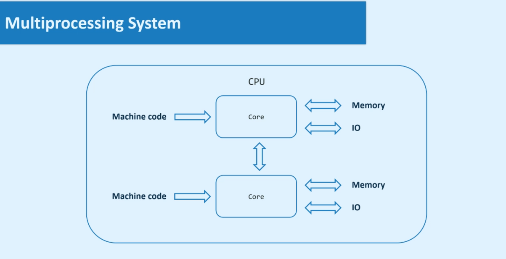
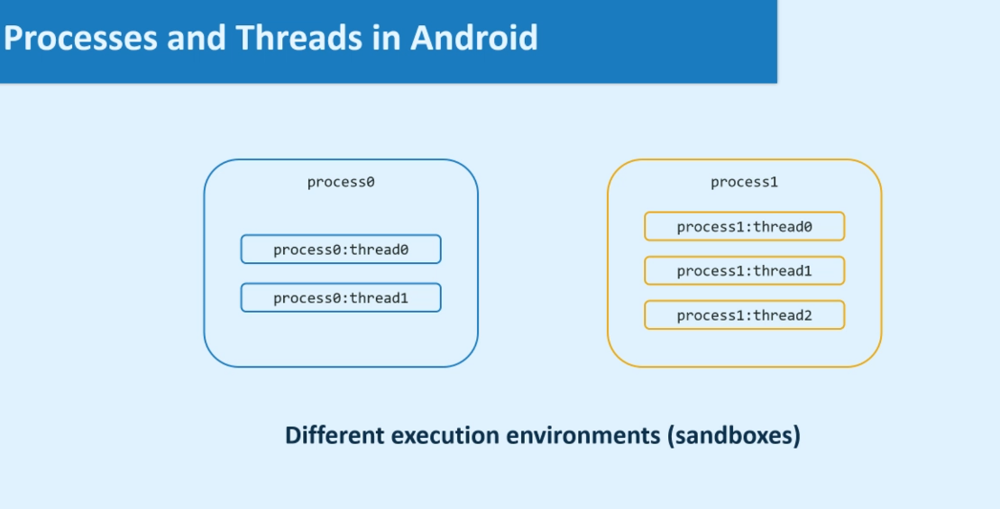
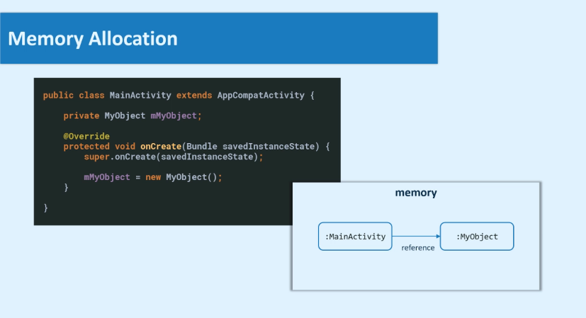
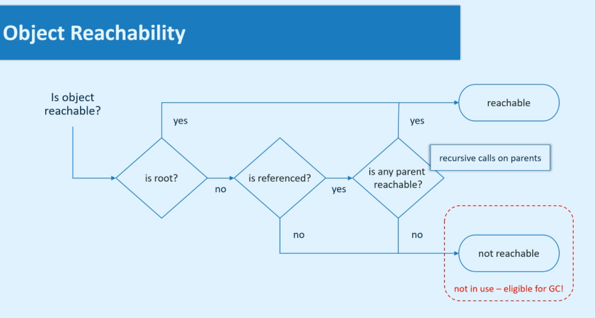
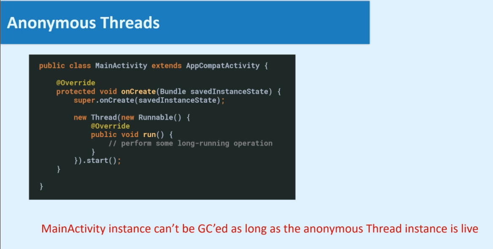
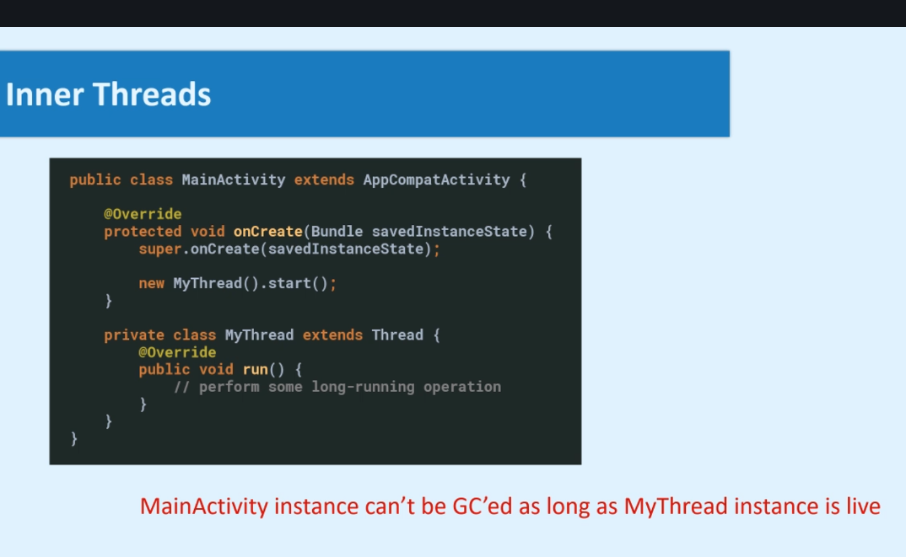
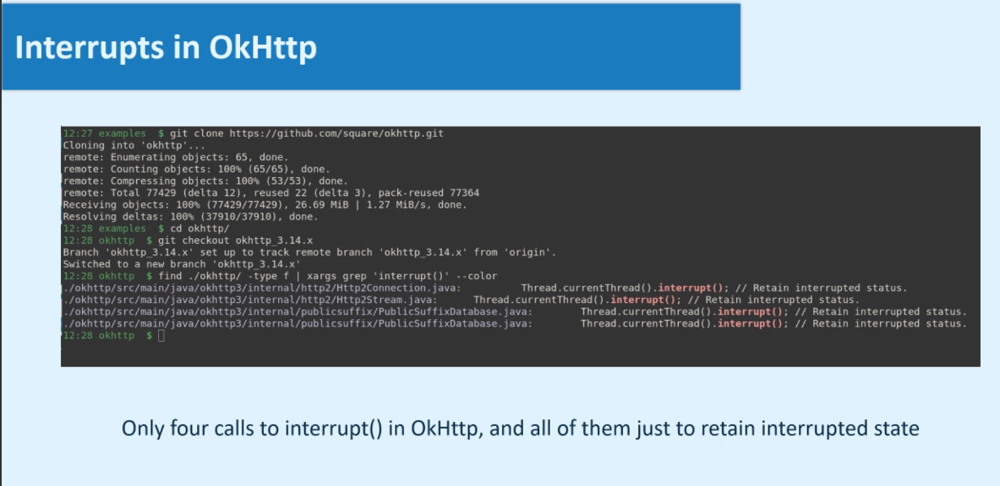

# Multitasking e multiprocessing

## Sistemas de tarefas de sistemas (CPU + OS)

### Sistema de single-tasking

Executa o código da máquina tarefa por tarefa, iniciando outra após a primeira terminar. Isso não necessariamente acontece de forma sequencial, ela pode pular uma tarefa, por exemplo. Com esse sistema, a CPU fica totalmente dedicada à execução deste programa/ tarefa. O último OS que usou esse sistema foi o MS-DOS.

### Sistema de multitasking cooperativo

Executa tarefas individualmente e libera recursos da CPU com o "yielding" (render-se), permitindo que outra tarefa seja executada, com a intenção de ser retomada depois. Cada tarefa individual é responsável a render-se em algum ponto para liberar CPU para outras tarefas. A grande vantagem é que esse sistema dá a impressão que a execução é concorrente, em paralelo, por conta da velocidade do processamento da CPU. A desvantagem é que se uma tarefa não se comportar como deveria, todo o sistema pode travar.

### Sistema de multitasking preemptivo

Neste sistema o sistema operacional é quem gerencia os recursos da CPU alocando o tempo da CPU em diferentes tarefas, de acordo com o seu próprio algoritmo de agendamento. Basicamente, o sistema é quem diz quando cada tarefa rodará, podendo pausar uma tarefa para outra rodar. Esse processamento também ocorre de forma bem rápida, o que dá a impressão ao usuário que acontece paralelamente.

> Em computação, preemptividade é o ato de interromper temporariamente uma tarefa sendo executada por um sistema computacional, sem exigir sua cooperação, e com a intenção de retomar à tarefa posteriormente. Tais mudanças da tarefa executada são conhecidas como trocas de contexto.

A vantagem é que permite a execução simultânea de múltiplas tarefas e também garante a responsividade do sistema. A desvantagem é que esse tipo de sistema é muito complexo, se não fosse pela abstração que os sistemas operacionais fazem. Todos os sistemas modernos aplicam esse tipo de sistema, inclusive o Android.

### Sistema de multiprocessos

São sistemas com mais de 1 CPU. Na prática, o processador possui várias CPUS internas, chamadas de cores.



Esses cores não são totalmente independentes um do outro, mas se comunicam de forma muito complexa para que todos os processos fiquem coerentes e sincronizado. O sistema de multiprocessamento permite o paralelismo.

## Simultaneidade vs. Paralelismo

- Simultaneidade é quando múltiplas tarefas **parecem** progredir durante o mesmo período de tempo.
- Paralelismo é quando múltiplas tarefas **progridem** ao mesmo tempo instantâneo.

Todos os sistemas que permitem paralelismo também permitem simultaneidade, mas nem todos os sistemas que permitem simultaneidade permitem paralelismo. Por exemplo, sistemas com apenas 1 CPU geralmente suportam apenas multitasking. Desenvolvedores Android não precisam pensar sobre multiprocessing e paralelismo, mas precisam se concentrar na simultaneidade. Uma dica é assistir [esse vídeo do Rob Pike falando que Simultaneidade não é Paralelismo](https://vimeo.com/49718712). 

## Processos no Android e Threads

### Processos

Em um sistema que não é multitasking, só há uma tarefa que corresponde a um único programa em execução. No Android, que é multitasking, cada aplicação rodando recebe sua própria tarefa e essa tarefa é associada com um ambiente de execução isolado, chamado de *sandbox*. Juntos, eles formam um **processo**. Com isso, é possível afirmar que já que os processos são sandboxes no Android, uma aplicação não pode acessar o ambiente de uma outra aplicação (por motivos de confiabilidade e segurança).


### Threads

Os primeiros sistemas de multitasking permitiam que vários programas rodassem simultaneamente em processos separados, mas cada programa tinha apenas uma tarefa para si mesmo e que era associada com o processo do programa. Logo ficou evidente que um único programa poderia se beneficiar em ser fragmentado em múltiplas tarefas simultâneas. Em Android, cada processo pode ter uma ou mais tarefas. Isso são as threads.

Threads compartilham o ambiente de execução do processo pai, por isso ela pode se comunicar e trocar dados facilmente, é claro, com limites para cada processo.



# Multithreading

É a fragmentação da lógica da aplicação em tarefas múltiplas e simultâneas.

## Classe java.lang.Thread 

Esta classe representa uma thread de execução (ou seja, uma tarefa) em processo.

Há duas maneiras de instanciar novas threads:

1. Criar uma classe que extende de Thread e personalizar o corpo do método sobreposto `run()`. E depois instanciar esta abstração. Esse método usa **herança**
2. Essa forma envolve o objeto `runnable` , que são basicamente containers para código, mas que não vão especificam como esse código será executado e em qual thread. Depois, instancia uma `Thread(runnable)` e passa o runnable dentro. Esse método usa **composição**, que acaba sendo melhor de ser utilizado.

Instanciar esse objeto é diferente de começar uma nova thread. Para que ela de fato rode, ela precisa de um `thread.start();`

## Garbage Collector

Para entender Garbage Collector, é preciso primeiro entender o que é a alocação de memória. A criação de objetos consome uma quantidade de memória disponível. No exemplo abaixo, o objeto da MainActivity é criado no método `onCreate()`, então ele já aloca espaço na memória. O objeto MyObject segue o mesmo princípio, ele aloca memória no momento que é instanciado e recebe uma referência do MainActivity porque é instanciado dentro de MainActivity.



> Se a memória alocada nunca for liberada, mais cedo ou mais tarde a aplicação vai crashar com a exceção `OutOfMemoryException`

É aí que o **Garbage Collector** entra. É um processo do sistema que automaticamente recupera a memória descartando objetos que não estão sendo usados mais. Para entender como o Garbage Collector sabe que um objeto não está sendo mais usado, é preciso entender o conceito de **object reachability**. 



Por padrão, acitivities no Android são alcançáveis até que o Android invoque o método `onDestroy()`. É aí que o GC pode atuar, depois que as activities são destruídas.

Mas e se caso você tenha dois objetos, um apontando para o outro? Se não existir outras referências que apontem para esses objetos, ambos são considerados fora de alcance (not reachable) e, portanto, ambos são elegíveis para serem limpados pelo Garbage Collector. Isso significa que o GC pode lidar com **circular references** envolvendo vários objetos.

Todos os objetos no seu app devem ser coletados pelo GC eventualmente, exceto objetos que você explicitamente quer usar por todo o ciclo de vida da aplicação.

## Memory Leaks

É quando você tem um objeto que não será usado pela aplicação de novo, mas não pode ser limpa pela GC, e aí ele fica consumindo a memória para sempre. É o caso dos **roots**, objetos que são considerados alcançáveis, mas que não são limpos pelo GC. Basicamente, roots são objetos que guardam a memória de outros objetos.

Alguns roots importantes em uma aplicação Android:

1. Objetos referenciados de campos estáticos. Ex: `private static List lista = new ArrayList()`
2. Instâncias da classe Application (não são roots, mas se comportam como se fossem)
3. Live threads (threads ativas)

## Ciclo de vida das threads

Do momento que uma thread tem o `start()` até o retorno do método `run()`, todos os objetos referenciados nela são alcançáveis, ou seja, não podem ser limpos pelo GC. Dois tipos especiais de referências que podem ser perigosas neste contexto são instâncias de classes anônimas e classes internas, que possuem referências implícitas dos objetos-pai.





É por isso que **todas as threads na aplicação devem ser encerradas no momento oportuno para evitar memory leaks**. E qual é o momento oportuno? Depende um pouco dos requerimentos do app, pode até definir que algumas threads devem ser live, que fiquem abertas enquanto a aplicação estiver aberta. Então isso acontece no melhor momento definido pelo desenvolvedor. Uma thread é considerada "morta" depois que o método `run()` retorna. Existem 4 maneiras de fazer isso:

1. Usar o return do método `run()` depois de uma execução bem sucedida
2. Usar o return do método `run()` ao responder a um erro interno, ou seja, quando algo deu errado e não foi bem sucedida
3. Usar o return do método `run()` em resposta a uma flag setada externamente, por exemplo, encerrar quando um boolean se tornar falso. Um detalhe é que se essa flag for alterada depois da execução da condição que verifica ela, ela não terá efeito nenhum e não interromperá a thread.
4. Usar o return do método `run()` em resposta a uma interrupção. A abordagem 3 é mais confiável do que essa, porque o mecanismo das threads é bem complexo.

Exemplo da abordagem 4, interrompendo com OkHttp.



## UI Thread

É uma thread especial criada pelo framework do Android e associada a uma única aplicação. Basicamente, quando você abre uma aplicação, o Android cria essa thread e ela se torna a UI thread. As principais características são:

1. Iniciada pelo Android Framework quando o app abre
2. Encerrada somente quando os processos do app são encerrados
3. A interface do usuário é desenhada na UI thread
4. Os callbacks de ciclo de vida (`onStart(), onStop()`) são executados na UI thread
5. Qualquer evento de interação do usuário (`onClick()`)  são executados na UI thread
6. Qualquer mudança na interface do usuário deve ser realizada nesta thread

É também chamada de **main thread**. Nem em todos os casos a main thread é a Ui thread, mas essa distinção é irrelevante para desenvolvedores Android e para todos os casos práticos UI thread e main thread são a mesma coisa.

### Responsividade da UI

Neste contexto, a responsividade da UI não tem nada a ver com tamanho de tela, é somente a suavidade percebida pelo usuário. Ou seja, se o usuário realizar muitas coisas visualmente nesta thread, o app ficará menos responsivo.

Requerimentos de responsividade da UI:

- Aplicações Android devem renderizar 60 frames por segundo (FPS) > um novo frame deve ser renderizado a cada 16 milisegundos > Conclusão, seu código não deve executar na UI thread por mais que alguns milisegundos (depende de alguns fatores)

Alertas que você está extrapolando a responsividade da UI thread:

1. Congela a UI, animações não são fluídas, etc.
2. Notificações de frames skipped no Logcat
3. Crash por conta do ANR (Android Not Responding)

> Um dos pilares fundamentais de qualidade de apps Android é ter 0 frames skipped.

É por isso que **toda operação que consome tempo deve ser descarregada para background threads**.

### Conceitos de Handler e Looper

[Handler](https://github.com/aosp-mirror/platform_frameworks_base/blob/master/core/java/android/os/Handler.java) é simplesmente envolver uma thread e essa thread pode ser chamada de [Looper](https://github.com/aosp-mirror/platform_frameworks_base/blob/master/core/java/android/os/Looper.java) thread, porque enquanto ela não for parada, vai executar. MainLooper é basicamente uma abstração da Ui thread, que basicamente faz um loop em runnables do Android ou criados por você. O Handler ou o Looper não são construtores apropriados para serem utilizados em aplicações. O único uso prático de Handler em uma aplicação é para o exemplo seguinte, que acessa a UI thread.

```java
private final Handler myUiHandler = new Handler(Looper.getMainLooper());

//uso do Handler dentro de outra thread
private void countIterations() {
        new Thread(new Runnable() {
            @Override
            public void run() {
                long startTimestamp = System.currentTimeMillis();
                long endTimestamp = startTimestamp + ITERATIONS_COUNTER_DURATION_SEC * 1000;

                int iterationsCount = 0;
                while (System.currentTimeMillis() <= endTimestamp) {
                    iterationsCount++;
                }

                final int iterationsCountFinal = iterationsCount;
				//roda na UI Thread
                mUiHandler.post(new Runnable() {
                    @Override
                    public void run() {
                        Log.d("UiHandler", "Current thread: " + Thread.currentThread().getName());
                        mBtnCountIterations.setText("Iterations: " + iterationsCountFinal);
                    }
                });
            }
        }).start();
    }
```

## Background thread

É basicamente qualquer outra thread que não a UI  thread. Uma regra importante é que qualquer coisa que lide com views, com UI, deve ser feita somente na UI thread, também pelo motivo é que ela cria as views, portanto, deve lidar com tudo que é pertinente a essas views.

# Desafios do multithreading

Tomando novamente o exemplo de multitasking preemptivo, quando o PC vai executando tasks diferentes em uma mesma thread, ele inclui um contador que vai aumentando a cada task executada, então ele pausa e vai para outra thread, onde há um outro contador para as tasks que vão sendo executadas, até o momento em que ele volta para a thread 1, e continua a execução de onde parou.

> Se threads diferentes não acessam o mesmo estado, não é preciso tomar precauções especiais para garantir que tudo funcione. Se uma thread acessa a mesma parte de um estado do programa (shared state), é preciso garantir uma segurança para a thread (**thread-safety**).

Quando digo que é preciso garantir a thread-safety significa que o desenvolvedor precisa fazer isso, porque praticamente não há ferramentas que ajudem neste aspecto. Mas o que é thread safety? São três aspectos bem complexos considerados:

- Visibilidade
- Atomicidade
- Acontece antes

## 1 Visibilidade

Quando duas threads compartilham um mesmo estado, elas podem ter um problema de visibilidade deste estado, o que causa um mal-funcionamento em uma das threads. 

```java
/*
Consumer: detected count change 0
Producer: incrementing count to 1
Producer: incrementing count to 2
Producer: incrementing count to 3
Producer: incrementing count to 4
Producer: incrementing count to 5
Producer: terminating
*/

private static int sCount = 0;
	
    public static void main(String[] args) {
        new Consumer().start();
        try {
            Thread.sleep(100);
        } catch (InterruptedException e) {
            return;
        }
        new Producer().start();
    }
	
//o sCount não detecta as mudanças feitas pelo Producer, a JVM salva o valor antigo no cache e, portanto, printa apenas uma vez, mas fica no while loop para sempre.
    static class Consumer extends Thread {
        @Override
        public void run() {
            int localValue = -1;
            while (true) {
                if (localValue != sCount) {
                    System.out.println("Consumer: detected count change " + sCount);
                    localValue = sCount;
                }
                if (sCount >= 5) {
                    break;
                }
            }
            System.out.println("Consumer: terminating");
        }
    }

    static class Producer extends Thread {
        @Override
        public void run() {
            while (sCount < 5) {
                int localValue = sCount;
                localValue++;
                System.out.println("Producer: incrementing count to " + localValue);
                sCount = localValue;
                try {
                    Thread.sleep(1000);
                } catch (InterruptedException e) {
                    return;
                }
            }
            System.out.println("Producer: terminating");
        }
    }
```


## 2 Atomicidade

Quando duas (ou mais) threads alteram um valor simultaneamente, você quer basicamente que uma delas leia o valor atualizado pela outra e faça a sua modificação. O que na verdade acontece é que, às vezes, ambas as threads lêem o mesmo valor da variável e fazem a alteração, meio que estragando a intenção da operação, o que é o caso do exemplo abaixo. Não há como prever o quanto de dado é perdido nestes casos, mas isso depende do agendamento das threads pelo OS e quando o sistema disponibiliza as threads e a oportunidade delas rodarem.

```java

@SuppressLint("SetTextI18n")
public class AtomicityDemonstrationFragment extends BaseFragment {

    private static final int COUNT_UP_TO = 1000;
    private static final int NUM_OF_COUNTER_THREADS = 100;

    public static Fragment newInstance() {
        return new AtomicityDemonstrationFragment();
    }

    private Button mBtnStartCount;
    private TextView mTxtFinalCount;

    private Handler mUiHandler = new Handler(Looper.getMainLooper());
	
    //a keyword volatile evita que aconteça o problema de visibilidade
    private volatile int mCount;

    @Nullable
    @Override
    public View onCreateView(@NonNull LayoutInflater inflater, @Nullable ViewGroup container, @Nullable Bundle savedInstanceState) {
        View view = inflater.inflate(R.layout.fragment_atomicity_demonstration, container, false);

        mTxtFinalCount = view.findViewById(R.id.txt_final_count);

        mBtnStartCount = view.findViewById(R.id.btn_start_count);
        mBtnStartCount.setOnClickListener(new View.OnClickListener() {
            @Override
            public void onClick(View v) {
                startCount();
            }
        });

        return view;
    }

    @Override
    protected String getScreenTitle() {
        return "";
    }

    @Override
    public void onStart() {
        super.onStart();
    }

    @Override
    public void onStop() {
        super.onStop();
    }

    private void startCount() {
        mCount = 0;
        mTxtFinalCount.setText("");
        mBtnStartCount.setEnabled(false);

        for (int i = 0; i < NUM_OF_COUNTER_THREADS; i++) {
            startCountThread();
        }

        mUiHandler.postDelayed(new Runnable() {
            @Override
            public void run() {
                mTxtFinalCount.setText(String.valueOf(mCount));
                mBtnStartCount.setEnabled(true);
            }
        }, NUM_OF_COUNTER_THREADS * 20);
    }

    private void startCountThread() {
        new Thread(new Runnable() {
            @Override
            public void run() {
                for (int i = 0; i < COUNT_UP_TO; i++) {
                    mCount++; 
                    // é a mesma coisa que ler a variável, incrementar e depois gravar o novo valor - quando acontece em duas threads diferente, podem ser que ambas incrementem sobre o mesmo valor, ao invés de uma incrementar após a outra atualizar o valor
                }
            }
        }).start();
    }
}
```

O Android Studio reconhece problemas de non-atomic apenas em casos mais simples, como o `mCount++`. Então sempre que uma single thread atua em uma operação do tipo read-modify-write ou compare-and-swap (CAS), nenhuma outra thread deve ter permissão para acessar essa variável.

Uma operação do tipo CAS trabalha em 3 operações:

1. A alocação na memória onde vai operar (M)
2. O valor existente (A) esperado da variável
3. O novo valor (B) que precisa ser setado

> A operação CAS atualiza atomicamente o valor no M para B, mas apenas se o valor existente em M for igual ao A, caso contrário nenhuma ação é tomada.

Em ambos os casos, o valor existente em M é retornado. Isso combina 3 passos - pegar o valor, comparar e atualizar - em apenas uma operação singular a nível de máquina. Quando múltiplas threads tentam fazer o update (atualização) no mesmo valor por meio do CAS, uma delas vence e consegue atualizar o valor. Contudo, as outras threads não são suspensas, e ao invés disso, elas são simplesmente informadas de que não conseguiram dar update no valor. Isso traz a consequência de que o app fica mais complexo, porque precisa considerar este cenário que o CAS não deu certo nas threads.

## Variáveis voláteis

É uma keyword especialmente usada em variáveis e significa que qualquer valor que for nessa variável vai para a memória principal. Este valor nunca será cacheado. **Isso resolve o problema de visibilidade, mas não a atomicidade**, além de ser meio difícil de perceber que essa limitação foi resolvida, pois a variável volátil é só percebida quando declarada, não nas chamadas. 

A questão da memória é um outro ponto que pode não ser tão usual em todas as situações, porque ela vai direto para a memória principal, ignorando todos os caches e atualizando esses dados sempre que carregados.

## Atomic Classes

O Java tem essas classes que fazem um wrap das variáveis primitivas com o objetivo de serem inseridas de forma segura em um contexto de multi-thread. Elas são chamadas de atomic variables porque provêm algumas operações que não podem ser inferidas por múltiplas threads. São algoritmos não-bloqueantes para ambientes simultâneos. Esses algoritmos exploram instruções atômicas de baixo nível como um compare-and-swap (CAS) ou como mencionado read-modify-write, para garantir a segurança dos dados. É garantido que as threads não podem ler este valor em paralelo. As variáveis e classes atômicas parecem, para o exterior, uma única operação.

Transformar uma variável em atômica não resolve o problema de visibilidade, então pode ser que seja mais útil combinar volatile variable e atomic classes. É o que foi usado para resolver o problema 2. Mas não é garantido que sempre que a variável atômica for criada, ela terá a referência da instanciação do objeto. Ela garante que os métodos serão executados de forma atômica, mas o fato de usar uma variável atômica sozinha não garante que threads diferentes serão capazes de passar a referência para essa variável de forma segura.

## Sincronização de threads

Dependendo do tipo de dado que você tem, usar classes atômicas pode não ser eficiente. Para explicar a sincronização, é usada uma metáfora de um *talking stick* ou *speaker's staff*, um instrumento de origem aborígene que pratica a democracia usada por muitas tribos, principalmente índigenas da costa noroeste dos EUA. Ele garante que somente uma pessoa fale em um instante do tempo. A ideia é que eles não interrompam uns aos outros e garantam o diálogo. A sincronização é muito similar a um talking stick. O objeto LOCK é o talking stick e o só uma thread pode ter o LOCK de cada vez.  Basicamente, quando o Consumer tiver em poder desse LOCK, o Producer vai precisar esperar que o Consumer libere o LOCK para pegar. É garantido que se o Consumer pegar o LOCK no bloco `synchronized(LOCK)` ele vai manter o LOCK até que o que está dentro do bloco complete. E, depois que o que está no bloco for executado, é garantido que o conteúdo dele será visível pelo outro que usou o mesmo LOCK.

```java
public class SynchronizationDemonstration {

    private static final Object LOCK = new Object();

    private static int sCount = 0;

    public static void main(String[] args) {
        new Consumer().start();
        try {
            Thread.sleep(100);
        } catch (InterruptedException e) {
            return;
        }
        new Producer().start();
    }

    static class Consumer extends Thread {
        @Override
        public void run() {
            int localValue = -1;
            while (true) {
                synchronized (LOCK) {
                    if (localValue != sCount) {
                        System.out.println("Consumer: detected count change " + sCount);
                        localValue = sCount;
                    }
                    if (sCount >= 5) {
                        break;
                    }
                }
            }
            System.out.println("Consumer: terminating");
        }
    }

    static class Producer extends Thread {
        @Override
        public void run() {
            while (true) {
                synchronized (LOCK) {
                    if (sCount >= 5) {
                        break;
                    }
                    int localValue = sCount;
                    localValue++;
                    System.out.println("Producer: incrementing count to " + localValue);
                    sCount = localValue;
                }
            }
            System.out.println("Producer: terminating");
        }
    }

}
```

A sincronização resolve tanto o problema de visibilidade e de atomicidade. Existem algumas coisas que demandam atenção para a sincronização também: o que fica dentro e fora do bloco `syncronized(LOCK)` deve ser bem estudado, caso contrário comportamentos estranhos acabam surgindo; além disso, se uma thread ficar com o LOCK por muito tempo, então pode ser que nenhuma outra thread acabe pegando o LOCK e executando; o objeto que representa o talking stick deve ser o mesmo para as threads que precisam ser sincronizadas entre si. É uma abordagem bem difícil de ser aplicada corretamente e mesmo assim, pode levar a uma confusão quando múltiplas threads competem pelo mesmo objeto LOCK. Por isso, a sincronização é indicada apenas depois de ter considerado as outras opções. Por outro lado, se você tem um caso de uso simultâneo relativamente complexo e precisa de múltiplas threads cooperando e compartilhando alguns dados, então não tenha medo de usar totalmente a sincronização manual.

## Imutabilidade

No caso do exemplo de Atomicidade, foi usado Atomic variable e variável volátil, para resolver tanto a questão da visibilidade quanto da atomicidade. Mas sempre que o Fragment é iniciado, imediatamente a variável é inicializada e ela  nunca muda. Ao invés de fazer com que ela seja volátil, ela pode ser **final**. De acotdo com a documentação do Java, variáveis finais são thread safe de forma que, uma vez transformadas em finais, quaisquer threads pegarão a referência correta dela.

```java
private final AtomicInteger mCount = new AtomicInteger(0);
```

Algumas pessoas dizem que é preciso deixar as variáveis finais para evitar mudanças acidentais. Parece fazer sentido, mas não é a razão principal para deixar as variáveis finais. A principal razão para usar variáveis finais é ter certeza que as diferentes threads que estão lendo terão o valor correto.

> Neste contexto, uma boa regra a seguir é que qualquer membro de uma classe que esteja sendo inicializada na construção da classe deve ser **final**. Não só dentro de construtor, mas que receba valores de argumentos de construtores.

## 3 Acontece antes

> **Visibilidade não é um conceito fundamental em Java.** Ao invés disso, visibilidade é uma funcionalidade da relação de happens-before estabelecida (ou não) entre ações. O happens-before é um conceito mais low-level que visibilidade e é mais complexa de entender que a visibilidade.

Duas ações podem ser ordenadas por uma relação do tipo happens-before. Se uma ação deve acontecer antes da outra, então a primeira é visível para a segunda e ordenada antes da segunda. [Fonte](https://docs.oracle.com/javase/specs/jls/se7/html/jls-17.html). Uma questão que surge baseada nos exemplos anteriores: mas a ordem já não é garantida pela ordem do código e da chamada? Bem, não. É possível que as chamadas possam fazer uma pré-ordenação, então não é garantido que o fluxo de uma thread é tão linear assim. É para isso que funciona a relação happens-before, que garante a ordem e visibilidade de duas ações.

Algumas regras do happens-before, imaginando a situação: se temos duas ações x e y, escrevemos `hb(x, y)` para indicar que o x acontece antes do y.

1. Se x e y são ações **da mesma thread** e x vêm antes de y na ordem do programa, então `hb(x, y)`
2. Existe uma distância do happens-before do final do construtor do objeto para o início do final deste objeto. Este ponto não é tão útil para desenvolvedores Android, pois envolve `finalizes`, que não é algo que usamos ou escrevemos.
3. Se a ação x sincroniza (synchronized-with) com a ação seguinte y, então também temos `hb(x, y)`
4. Se `hb(x, y)` e `hb(y, z)`, então `hb(x, z)`

Entrando um pouco em detalhes no item 3, o mecanismo de sincronização inclui a keyword synchronized, a leitura e escrita de volatiles, java.util.concurrent, e mais.

As garantias do happens-before:

1. Um unlock no monitor acontece antes de cada subsequente lock no monitor. Monitor é o nome formal do objeto LOCK que foi usado no exemplo de Sincronização de threads.
2. A escrita de um campo volátil acontece antes de cada subsequente lida deste campo.
3. Uma chamada ao método `start()` de uma thread acontece antes de qualquer ação na thread iniciada.
4. Todas as ações em uma thread acontecem antes de qualquer outra thread retornar com sucesso de um `join()` naquela thread
5. A inicialização padrão (blocos de inicialização, como init/ static initialization) de qualquer objeto acontece antes de qualquer outra ação (além de escritas padrões) de um programa

## Resumo dos desafios do multithreading

Quando múltiplas threads acessam um estado compartilhado, o DEV precisa garantir:

1. A relação de acontece antes entre as escritas (write/set) em uma thread e as leituras (get/read) em outra

2. Atomicidade de operações em partes do código onde múltiplas threads podem interferir umas com as outras (sequências do tipo read-modify-write)

>   Classes especiais podem prover algumas garantias do happens-before (por exemplo, java.util.concurrent.atomic)

Construtores atômicos:

1. Membros do pacote java.util.concurrent.atomic (ex.: AtomicInteger)
2. Classes adicionais em java.util.concurrent (ex: ConcurrentHashMap.putIfAbsent(K, V))
3. Exclusão mútua de threads de seções críticas de código usando sincronização manual com locks ("monitor" em termos da documentação do Java)

> O único jeito de garantir segurança nas threads é entender os desafios do multithreading em detalhes e minuciosamente revisar o código para problemas de multithread.

# Pause threads

Razões para pausar as threads:

- Introduzir delays no fluxo do programa
- Esperar por eventos assíncronos
- Coordenar a execução entre múltiplas threads

A maneira mais simples de pausar threads é implementar o "ocupado esperando" (busy-waiting). Um exemplo disso é a demo de Visibilidade, onde cada thread tem um loop while e umas condicionais que deixam o loop rodando enquanto não são atendidas. Esse busy-waiting consome muitos recursos, drenam bateria e podem estragar a responsividade do app. Por isso, **nunca use busy-waiting!!**

## Thread sleep

Essa é a primeira forma legítima de pausar uma thread. A ideia do sleep é bem simples, significa que a thread que é convidada a dormir não será agendada durante a duração setada para dormir. Ela não vai consumir recursos do sistema, exceto a memória que guarda durante esse período de dormência.

```java
Thread.sleep(1000);
```

É sempre usado com um try/catch, porque pode ser que, em casos raros, você queira encerrar o tempo de sleep antes que ele termine, então você pode tratar o comportamento quando isso acontece. Para fazer isso, você pode interromper a thread usando `interrupt()` , assim como é feito com o `start()` e, caso ela seja interrompida e lance o `InterruptedException`, realizará uma ação.

```java
try {
	Thread.sleep(1000);
} catch (InterruptedException e) {
	System.out.println("Producer: interrupted during sleep");
	return;
}
```

Interrupts são raramente usados no código, primeiro porque não são muito evidentes, o motivo de eles serem usados nunca são muito claros, sem contar o momento que ele interrompe não é muito preciso, você não consegue entender a intenção e o resultado da interrupção.

| Pros    | Contras                                                      |
| ------- | ------------------------------------------------------------ |
| Simples | Não são precisas                                             |
|         | O único jeito de acordar antes do timeout é usando interruption |

O principal uso de `Thread.sleep()` é adicionar delays em fluxos individuais.

## Thread wait

Em muitas situações, você vai querer pausar uma thread até que algum evento assíncrono aconteça. Usar sleep seria uma péssima escolha neste caso (como foi usado no exercício 4). 

| Pros                                                         | Contras      |
| ------------------------------------------------------------ | ------------ |
| Precisa                                                      | Complexidade |
| Pode ser usada por mais de uma thread                        |              |
| Thread automaticamente libera o LOCK que aguardou (ou seja, quando a thread usa o wait, libera o LOCK) |              |

O principal uso de `Thread.wait()` é para coordenar a execução de múltiplas threads. Existem métodos em classes especiais que podem fazer com que threads esperem quando chamadas, com implementações do wait(). Um exemplo é o BlockingQueue que tem um método `take()`, que usa a mesma abordagem que o wait tem.

```java
// wait usado em conjunto com uma AtomicBoolean flag
synchronized(PRODUCER_FLAG){
	while (!PRODUCER_FLAG.get()){
		try {
			PRODUCER_FLAG.wait();
		} catch (InterruptedException e){
			return;
		}
	}
}
```


## Thread join

Fazer `join()` em uma thread faz com que a thread que chamou o join espere até que a thread chamada termine.

```java
Thread producer = new Producer();
producer.start();
try {
    producer.join();
} catch (Interrupted Exception e) {
    return;
}
System.out.println("Main: returns");
```

Basicamente, tudo o que você faz com `join()`, pode ser feito com `wait()`. Mas caso precise escolher se usa um ou outro, definitivamente vá pela solução mais simples, que é o `join()`. O `join()` também atende bem ao happens-before, com a regra de que "todas as ações em uma thread acontecem antes de qualquer outra thread retornar com sucesso de um `join()` naquela thread".

## Blocked Thread

É basicamente a mesma coisa que paused thread. BlockingQueue é um dos métodos que podem pausar a thread.

> Não há riscos para a performance em usar diretamente Threads em sua aplicação. Ainda não é a escolha ideal por conta de outros fatores, mas em termos de performance criar e gerenciar as threads de forma crua e diretamente com o Java Thread Class não é um problema.

# Clean Design

Tem um design limpo no código de multi threads é de extrema importância

# Links

- https://vimeo.com/49718712
- [Java atomic variables](https://www.baeldung.com/java-atomic-variables)
- [Java Section 17 Documentation - Threads and Locks](https://docs.oracle.com/javase/specs/jls/se7/html/jls-17.html)
- [Curso base deste conteúdo - Udemy](https://www.udemy.com/share/1029HQBkUddFpTTQ==/)

